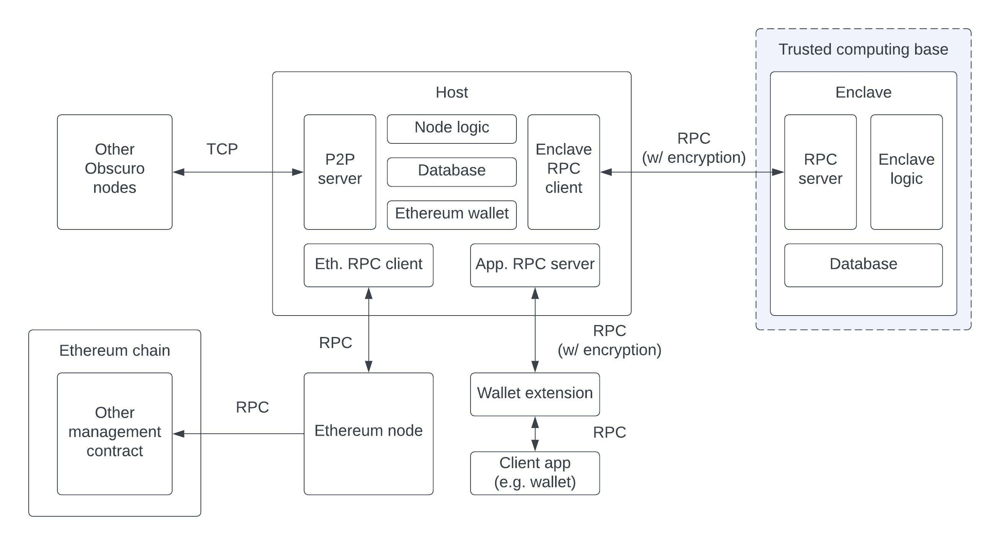

# Go Obscuro

This repository contains the reference implementation of the [Obscuro Protocol](https://whitepaper.obscu.ro/).

*Note that this is still very much a work in progress, so there are many rough edges and unfinished components.*

## High level overview

The typical blockchain node runs multiple services in a single process. For example:
- P2P Service
- RPC Service
- Data storage
- Transaction execution
- Mempool
- etc 

Obscuro uses Trusted Execution Environments (TEE), like Intel SGX, to execute transactions in a confidential environment, which means we diverge from the typical architecture. 
There are three main components of the architecture, each running as a separate process: the Enclave, the Host and the Wallet Extension.



### I. The Enclave

This is the core component of Obscuro which runs inside the TEE. 
See [go/enclave](go/enclave)

We use [EGo](https://www.edgeless.systems/products/ego/), an open source SDK for developing this confidential component.

The Enclave exposes an [interface](go/common/enclave.go) over RPC which attempts to minimise the "trusted computing base"(TCB).

The Enclave component has these main responsibilities:

#### 1. Execute EVM transactions
Obscuro has the goal to be fully compatible with the EVM, so smart contracts can be ported freely from other EVM compatible
chains. To achieve this and minimise the effort and incompatibilities, we depend on [go-ethereum](https://github.com/ethereum/go-ethereum).

The dependency on go-ethereum is not straight forward, since transaction execution is coupled with Ethereum specific consensus rules,
which had to be mocked out.

See [go/enclave/evm](go/enclave/evm)


#### 2. Store the state
The dependency on `go-ethereum` for transaction execution, means that we use the same storage interfaces.

In the current iteration we use [EdglessDB](https://www.edgeless.systems/products/edgelessdb/), an open source database tailor-made 
for confidential computing.

`go-ethereum` uses a key-value store interface, which we implement on top of the SQL database. The reason for this odd choice 
is that the data needs to be indexed and encrypted before being sent for storage. And the operation of storing data needs 
to be resistant to side-channel analysis which would allow an attacker to infer information on what calculations are being made
based on what data the Enclave is requesting or storing.

In a future iteration, we'll look at alternatives to connect to a performant key-value store designed or modified for confidential computing.

See [go/enclave/db](go/enclave/db)


#### 3. Consume Ethereum blocks 
The Enclave is fed Ethereum blocks through the RPC interface. These blocks are used as the "Source of Truth", and the Enclave 
extracts useful information from them, such as published rollups, deposits to the bridge, etc. Ethereum re-orgs have to be detected
at this level to rollback the Obscuro state accordingly.

To avoid the risk of the Enclave being fed invalid blocks which an attacker can use to probe for information, or to shorten the 
[revelation period](https://whitepaper.obscu.ro/obscuro-whitepaper/detailed-design.html#revelation-mechanism), the blocks have to be checked for validity, which includes checking that enough "work" went into them.
To achieve this we depend on the [Blockchain](https://github.com/ethereum/go-ethereum/blob/e6fa102eb08c2b83ab75e85ca7860eea3a10dab0/core/blockchain.go) 
logic.


#### 4. Bridge to Ethereum 
One of the key aspects of Ethereum Layer 2 (L2) solutions is to feature a decentralised bridge that is resistant to 51% attacks.

Obscuro features a L2 side of the bridge that is completely under the control of the platform.

##### a) Deposits
During processing of the Ethereum blocks, the platform generates synthetic L2 transactions based on every relevant transaction found there.
For example when Alice deposits 10ABC from her account to the L1 bridge, Obscuro will execute a synthetic L2 transaction (that it deterministically
generated from the L1 transaction), which moves 10WABC from the L2 bridge to Alice's address on Obscuro. 

This logic is part of the consensus of Obscuro, every node receiving the same block containing the rollup and the deposits, will generate the exact same synthetic transaction.

##### b) Withdrawals
Obscuro ERC20 transactions sent to a special "Bridge" address are interpreted as withdrawals. Which means the wrapped tokens are burned
on the Obscuro side of the bridge and a Withdrawal instruction is added to the rollup header, which will be later executed by the Ethereum side of the bridge.

This happens deterministically in a post-processing phase, after all Obscuro transactions were executed by the EVM.


See [go/enclave/bridge](go/enclave/bridge)

*Note that the current bridge implementation is very primitive and only features two supported hardcoded ERC20 tokens to demonstrate
the mechanics.*


#### 5. Mempool 

The mempool is the component which handles the incoming transactions and is responsible for selecting which transactions 
to include in the current batch and pick the order.

The big advantage of running the mempool inside the secure Enclave is that the ordering of transactions cannot be gamed by the aggregator, 
which makes MEV much more difficult.

See [go/enclave/mempool](go/enclave/mempool)

*Note that the current mempool implementation is very primitive. It always includes all received transactions that were not already
included in a rollup.*


#### 6. The rollups and the PoBI protocol

Like in any blockchain the unit of the protocol is the batch of transactions organized in a chain. 
The Obscuro blocks have an encrypted payload, which is only visible inside the secure Enclave.
All of the logic of maintaining the current state based on incoming data and of producing new rollups is found in the
[go/enclave/rollupchain](go/enclave/rollupchain) package.


#### 7. Cryptography

This is where the Obsuro specific cryptography is implemented.
See [go/enclave/crypto](go/enclave/crypto)

These are the main components:

##### a) RPC encryption/decryption

The Obscuro "Wallet extension" encrypts all requests from users (transactions or smart contract method calls) with the "Obscuro public key", which is a key derived from the 
master seed. 
The response is in turn encrypted with the "Viewing Key" of the requesting user.

This component manages viewing keys and handles the encryption and decryption.

The transactions received from users are gossiped with the other aggregators encrypted with the "Obscuro Public Key".

*Note: In the current implementation, this key is hardcoded.*

See: [go/enclave/rpcencryptionmanager](go/enclave/rpcencryptionmanager)

##### b) Transaction blob encryption

Transactions are stored as `calldata` blobs in ethereum transactions.
The component that creates these blobs has to encrypt them with derived keys according to their revelation period.

*Note: In the current implementation the payload is encrypted with a single hardcoded key*

See: [go/enclave/crypto/transaction_blob_crypto.go](go/enclave/crypto/transaction_blob_crypto.go)


#### 8. RPC

The enclave exposes an RPC interface generated with [proto-buf](https://developers.google.com/protocol-buffers).

The interface is described in [enclave.proto](go/common/rpc/generated/enclave.proto).

See [go/common/rpc](go/common/rpc)

### II. The Host

The Host service is the software that is under the control of the operator. It does not run inside a secure Enclave, and there is no attestation on it.

From a threat model point of view, the Host service is seen as an adversary by an Enclave. Any data that it feeds into the Enclave
will be verified and considered malicious.

A secure solution that uses confidential computing will generally try to minimize the TCB, and run as much as possible outside the secure Enclave,
while still achieving the same security goals.

The Host service is the equivalent of a typical blockchain node, and is responsible for:
 
- P2P messaging: Gossiping of encrypted transactions and rollups
- RPC: Exposing an RPC interface similar to the one exposed by normal Ethereum nodes
- Communicating with an Ethereum node for retrieving blocks and for submitting transactions with data that was generated inside the Enclave.
  This means an Ethereum wallet and the control keys to accounts with enough ETH to publish transactions is required.


See [go/host](go/host)

*Note: The code for host is currently in an incipient phase. The focus of the first phase of development was on the main 
building blocks of the Enclave* 


### III. The Wallet Extension

The missing link to achieving fully private transactions while allowing end-users to continue using their favourite 
wallets (like MetaMask). This is a very thin component that is responsible for encrypting and decrypting traffic 
between the Obscuro node and its clients.

See the [docs](https://docs.obscu.ro/wallet-extension/wallet-extension/) for more information.


## Repository Structure

<pre>
root
├── <a href="./contracts">contracts</a>: : Solidity Management contract, which will be deployed on Ethereum
├── <a href="./go">go</a>
│   ├── <a href="./go/common">common</a>: Unstructured package containing base types and utils. Note: It will be cleaned up once more patterns emerged.
│   ├── <a href="./go/config">config</a>: A place where the default configurations are found.
│   ├── <a href="./go/enclave">enclave</a>: The component that is loaded up inside SGX.
│   │   ├── <a href="./go/enclave/bridge">bridge</a>: The platform side of the decentralised bridge logic.
│   │   ├── <a href="./go/enclave/core">core</a>: Base data structures used only inside the enclave. 
│   │   ├── <a href="./go/enclave/crypto">crypto</a>: Implementation of the Obscuro cryptography.
│   │   ├── <a href="./go/enclave/db">db</a>: The database implementations. 
│   │   ├── <a href="./go/enclave/enclaverunner">enclaverunner</a>: The entry point to the standalone enclave process. 
│   │   ├── <a href="./go/enclave/evm">evm</a>: Obscuro transaction execution on top of the EVM.
│   │   ├── <a href="./go/enclave/main">main</a>: Main
│   │   ├── <a href="./go/enclave/mempool">mempool</a>: The mempool living inside the enclave
│   │   ├── <a href="./go/enclave/rollupchain">rollupchain</a>: The main logic for calculating the state and the POBI protocol.
│   │   └── <a href="./go/enclave/rpcencryptionmanager">rpcencryptionmanager</a>: Responsible for encrypting the communication with the wallet extension.
│   ├── <a href="./go/ethadapter">ethadapter</a>: Responsible for interpreting L1 transactions 
│   │   ├── <a href="./go/ethadapter/erc20contractlib">erc20contractlib</a>: Understand ERC20 transactions.
│   │   └── <a href="./go/ethadapter/mgmtcontractlib">mgmtcontractlib</a>: Understand Obscuro Management contrract transactions. 
│   ├── <a href="./go/host">host</a>: The standalone host process.
│   │   ├── <a href="./go/host/db">db</a>: The host's database.
│   │   ├── <a href="./go/host/hostrunner">hostrunner</a>: The entry point.
│   │   ├── <a href="./go/host/main">main</a>: Main
│   │   ├── <a href="./go/host/node">node</a>: The host implementation.
│   │   ├── <a href="./go/host/p2p">p2p</a>: The P2P communication implementation.
│   │   └── <a href="./go/host/rpc">rpc</a>: RPC communications with the enclave and the client.
│   │       ├── <a href="./go/host/rpc/clientapi">clientapi</a>: The API for RPC communications with the client.
│   │       ├── <a href="./go/host/rpc/clientrpc">clientrpc</a>: The RPC server for communications with the client.
│   │       └── <a href="./go/host/enclaverpc">enclaverpc</a>: The RPC client for communications with the enclave.
│   ├── <a href="./go/rpc">rpcclientlib</a>: Library to allow go applications to connect to a host via RPC.
│   └── <a href="./go/wallet">wallet</a>: Logic around wallets. Used both by the node, which is an ethereum wallet, and by the tests
├── <a href="./integration">integration</a>: Integration tests that spin up Obscuro networks.
│   ├── <a href="./integration/simulation">simulation</a>: A series of tests that simulate running networks with different setups.
├── <a href="./testnet">testnet</a>: Utilities for deploying a testnet.
└── <a href="./tools">tools</a>: Peripheral tooling. 
│   ├── <a href="./tools/azuredeployer">azuredeployer</a>: Automates deployment of Obscuro nodes to SGX-enabled Azure VMs.
│   ├── <a href="./tools/contractdeployer">contractdeployer</a>: Automates deployment of ERC20 and management contracts to the L1.
│   ├── <a href="./tools/networkmanager">networkmanager</a>: Network management tooling. Automates deployment of ERC20 and management contracts to the L1, and allows the injection of transactions into the network to simulate activity.
│   ├── <a href="./tools/obscuroscan">obscuroscan</a>: Tooling to monitor network transactions.
│   └── <a href="./tools/walletextension">walletextension</a>: Ensures sensitive messages to and from the Obscuro node are encrypted.

</pre>


## Testing

The Obscuro integration tests are found in: [integration/simulation](integration/simulation).

The main tests are "simulations", which means they spin up both an L1 network and an L2 network, and then inject random transactions.
Due to the non-determinism of both the "mining" protocol in the L1 network and the nondeterminism of POBI, coupled with the random traffic,
it allows the tests to capture many corner cases without having to explicitly write individual tests for them. 

The first [simulation_in_mem_test](integration/simulation/simulation_in_mem_test.go) runs fully in one single process on top of a 
mocked L1 network and with the networking components of the Obscuro node swapped out, and is just focused on producing 
random L1 blocks at very short intervals.  The [ethereummock](integration/ethereummock) implementation is based on the ethereum protocol with the individual nodes 
gossiping with each other with random latencies, producing blocks at a random interval distributed 
around a configured ``AvgBlockDuration``, and making decisions about the canonical head based on the longest chain.
The L2 nodes are each connected to one of these mocked L1 nodes, and receive a slightly different view.
If this test is run long enough, it verifies the POBI protocol.

There are a number of simulations that gradually become more realistic, but at the cost of a reduction in the number of 
blocks that can be generated.

The [simulation_geth_in_mem_test](integration/simulation/simulation_geth_in_mem_test.go) replaces the mocked ethereum nodes with a 
network of geth nodes started in clique mode. The lowest unit of time of producing blocks in that mode is `1 second`.

The [simulation_full_network_test](integration/simulation/simulation_full_network_test.go) starts standalone local processes for
both the enclave and the obscuro node connected to real geth nodes.

The [simulation_docker_test](integration/simulation/simulation_docker_test.go) goes a step further and runs the enclave in "Simulation mode" 
in a docker container with the "EGo" library. 

The [simulation_azure_enclaves_test](integration/simulation/simulation_azure_enclaves_test.go) is the ultimate test where the enclaves are deployed 
in "Real mode" on SGX enabled VMs on Azure.


A [transaction injector](integration/simulation/transaction_injector.go) is able to create and inject random transactions in any 
of these setups by receiving RPC handles to the nodes.


## Getting Started
The following section describes building the reference implementation of the Obscuro protocol, running the unit and 
integration tests, and deploying a local testnet for end-to-end testing. The reference implementation of Obscuro is 
written in [go](https://go.dev). Unless otherwise stated, all paths stated herein are relative to the root of the 
`go-obscuro` checkout.


### Dependencies
The following dependencies are required to be installed locally;

- [go](https://go.dev) (version > 1.18)
- [docker](https://docs.docker.com/get-docker/) (recommend latest version*)
- [docker compose](https://docs.docker.com/compose/install/) (recommend latest version)

Whilst the recommended version of go is > 1.18, the reference implementation uses _only_ language features up to and 
including 1.17. Using 1.18 is recommended for easier setup and installation and is backwards compatible with all 1.17 
language features. 
> :warning: Docker Desktop version 4.13 is known to have issues on ARM64 systems. If you experience daemon crashes and segmentation faults when running inside containers it is recommended to downgrade. Version 4.12 is the latest known to work.


### Building
To create the build artifacts local to the checkout of the repository the easiest approach is to build each component 
separately for the host, enclave, and wallet extension  i.e. 

```
cd ./go/host/main && go build && cd -
cd ./go/enclave/main && go build && cd -
cd ./tools/walletextension/main && go build && cd -
```

Running `go build ./...` to build all packages at the root level will build all packages, but it will discard the 
resulting artifacts; it therefore serves only as a check that the packages _can_ be built. Note that building the 
enclave using `go` will compile it for a non-SGX mode and allow it to be run for test purposes. Compiling for SGX mode 
requires `ego-go ` from [Ego](https://www.edgeless.systems/products/ego/) to be used in placement. This is done using 
a docker image as defined in [dockerfiles/enclave.Dockerfile](dockerfiles/enclave.Dockerfile). Note that building 
the host and enclave is included here for information only; when building to run a local or remote component, docker 
is used and the creation of the docker images automated as described in [Building and running a local testnet](#Building and running a local testnet). 


### Running the tests
The tests require an Obscuro enclave to be locally running, and as such the image should first be created and added to the 
docker images repository. Building the image is described in [dockerfiles](dockerfiles) and can be performed using the 
below in the root of the project;

```
docker build -t enclave -f ./dockerfiles/enclave.Dockerfile .
```

To run all unit, integration and simulation tests locally, run the below in the root of the project;

```
go test ./...
```

### Building and running a local testnet
At the moment running a local testnet has an additional dependency on [jq](https://stedolan.github.io/jq/) and the module 
should be additionally installed prior to starting the local testnet. See the `jq` documentation for installation
instructions. 

The testnet is constructed from docker images that have all executables built, installed and available for running. The 
images are created from the working directory of the repository checkout. To build the images and to add them into the 
docker images repository use;

```
cd ./testnet && ./testnet-local-start.sh 
```

The above will perform all the relevant builds and ensure the images are ready for running each component. 
Will then start each component with the alloted defaults. ~3-6 mins to complete depending on the build time. 

The defaults used are:

- `0x13E23Ca74DE0206C56ebaE8D51b5622EFF1E9944` is the public address of the pre-funded account on the L1 network used 
to deploy the Obscuro Management and the ERC20 contracts
- `0x0654D8B60033144D567f25bF41baC1FB0D60F23B` is the public address of the pre-funded account on the L1 network used to 
pay for Obscuro rollup transactions
- `f52e5418e349dccdda29b6ac8b0abe6576bb7713886aa85abea6181ba731f9bb` is the private key of the pre-funded 
account on the L1 network used to deploy the Obscuro Management and the ERC20 contracts
- `0x0000000000000000000000000000000000000001` is the host id of the Obscuro node when starting in a local mode
- `0xeDa66Cc53bd2f26896f6Ba6b736B1Ca325DE04eF` is the address of the Obscuro Management contract which is known a-priori as a nonce of 0 is used 
- `0xC0370e0b5C1A41D447BDdA655079A1B977C71aA9` is the address of the ERC20 contract which represents OBX and is known a-priori as a nonce of 1 is used
- `0x51D43a3Ca257584E770B6188232b199E76B022A2` is the address of the ERC20 contract which represents ETH and is known a-priori as a nonce of 2 is used

Once started Obscuroscan is available on `http://0.0.0.0:8098`.


### Building and running a local faucet
Deploying and interacting with contracts on Obscuro requires OBX to be allocated to an account via the faucet. The 
faucet [repo](https://github.com/obscuronet/faucet) should be cloned, and the container built and started to allow 
requests to be made to it. To build and run use;

```
git clone git@github.com:obscuronet/faucet.git
cd faucet
./container_build.sh 
./container_run.sh 
```

The faucet runs a web server within the container, with a port mapping of 8080 set to allow POST requests to be made to 
it for an allocation to an externally owned addressed e.g. for the account `0x0d2166b7b3A1522186E809e83d925d7b0B6db084`
the following curl command can be used;

```bash
curl --location --request POST 'http://127.0.0.1:8080/fund/obx' \
--header 'Content-Type: application/json' \
--data-raw '{ "address":"0x0d2166b7b3A1522186E809e83d925d7b0B6db084" }'
```


### Deploying contracts into a local testnet
Deploying and interacting with contracts on Obscuro requires the wallet extension to be running. The wallet extension is 
the Obscuro component that ensures that sensitive information in RPC requests between client applications and Obscuro 
cannot be seen by third parties. The wallet extension should be run local to the client application and is described in 
more detail at [docs/wallet-extension/wallet-extension.md](docs/wallet-extension/wallet-extension.md).

To start the wallet extension to run against a local testnet, in the go-obscuro repo use the below;

```
cd ./tools/walletextension/main/
go build -o wallet_extension 
./wallet_extension -nodeHost 127.0.0.1 -nodePortHTTP 13000 -nodePortWS 13001
```

Once the wallet extension is running, a contract can be deployed and interacted with either manually using Metamask and 
Remix (see[docs/testnet/deploying-a-smart-contract.md](docs/testnet/deploying-a-smart-contract.md)) or programmatically 
e.g. using web3.py(see [docs/testnet/deploying-a-smart-contract-programmatically.md](docs/testnet/deploying-a-smart-contract-programmatically.md)). 

Note that in order to interact with the main cloud hosted testnet, all that needs to be changed is to start the wallet 
extension using the default parameters, where the `nodeHost` will default to the testnet host URL `testnet.obscu.ro` i.e. 

```
cd ./tools/walletextension/main/
go build -o wallet_extension 
./wallet_extension 
```

## Community 

Development is discussed by the team and the community on [discord](https://discord.com/channels/916052669955727371/945360340613484684) 