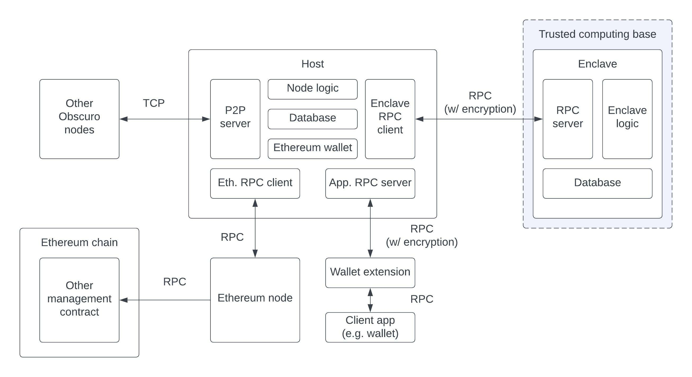

# Go Ten

This repository contains the reference implementation of the [Ten Protocol](https://whitepaper.ten.xyz/).

TEN is an encrypted EVM Ethereum Layer 2.

## High-level overview

TEN uses Trusted Execution Environments (TEE) to execute transactions in a confidential environment, which means we diverge from the typical EVM node architecture. 

There are three main components, each running as a separate process: the "Enclave", the "Host" and the "Gateway".



The "Gateway" exposes the standard Ethereum RPC and manages "Viewing Keys" on behalf of users. It is intended as a low-friction UX gateway into the encrypted network.
It runs in a TEE, and users connect via HTTPS directly into the TEE process.

The "Host" component is the "controller" of the TEN node. It is the active component that drives one or multiple passive "Enclaves"
The interactions between the host and the enclave are either responses to end-user queries or "administrative". 
The Host exposes an "encrypted RPC" (eRPC) for end-users. Basically, it doesn't have access to the user queries or responses.

The "Trusted Computed Base" is composed of the "Enclave" (the go codebase in this repo) and the dedicated encrypted relational database. 
The Enclave component's only interactions with the outside world are controlled by the "Host".

Below, we'll drill into each component and the services it runs.


### I. The Enclave

This is the core component of TEN, which runs inside the TEE. 
See [go/enclave](go/enclave)

We use [EGo](https://www.edgeless.systems/products/ego/), an open source SDK, for developing this confidential component.

The Enclave exposes [a few interfaces](go/common/enclave.go) over gRPC.

Note that the "Administrative" RPC is plaintext commands and responses that manage the lifecycle, while the "User" RPC takes encrypted inputs 
and returns encrypted outputs (or errors).

The Enclave component has these main responsibilities:

#### 1. Execute EVM messages
TEN has the goal to be fully compatible with the EVM, so smart contracts can be ported freely from other EVM-compatible
chains. To achieve this and minimise the effort and incompatibilities, we depend on [go-ethereum](https://github.com/ethereum/go-ethereum).

Note that the dependency on `go-ethereum` is not straightforward, since transaction execution is coupled with Ethereum-specific consensus rules,
which must be adapted.

See [go/enclave/evm](go/enclave/evm)

As a general rule, the `go-ethereum` EVM execution is sandwiched between a "pre-processing" and a "post-processing" phase.

Transactions, `eth_call` and `eth_estimateGas` messages are executed similarly.

#### 2. Encrypted State

The EVM is configured to use the "Path-Based Storage", which stores data using a key-value store interface.

For reasons we'll detail below, TEN requires a relational database that itself must run as an enclave and stores data encrypted.
The operation of storing data needs to be resistant to side-channel analysis, which would allow an attacker to infer information on what calculations are being made
based on the patterns of data the Enclave is requesting or storing.

Note: In the current iteration, we use [EdglessDB](https://github.com/ten-protocol/edgelessdb), an open source database tailor-made 
for confidential computing.

The data produced by the TEN network is private, so indexing services can't be built on top of it. This means the enclave itself has to be an "Indexing Service".

Alongside the "EVM State DB" required by go-ethereum, we also have a [relational database structure ](design/architecture/db_schema.png), 
where we store user queryable information along with visibility metadata. 
Conceptually, this schema serves as an "Infura" infrastructure with data access controls.

See [go/enclave/db](go/enclave/db)


#### 3. Mempool 

The mempool is the component which handles the incoming transactions and is responsible for selecting which transactions 
to include in the current batch and pick the order.

The big advantage of running the mempool inside the secure Enclave is that the ordering of transactions cannot be gamed by the sequencer, 
which prevents MEV.

We use the underlying mempool implementation from `go-ethereum`.


#### 6. Block production and consumption 

The TEN network has two node types: "sequencer" and "validators".

Only the "sequencer" has an active "mempool" and produces blocks. The validator nodes receive transactions from end users and validate them in order
to return relevant errors to the user.

Note: To avoid confusion with the "Ethereum Blocks", throughout the codebase (and in this readme), we'll use "Batch" as the name for the "TEN Blocks". 

Fundamentally, TEN works like any other blockchain and produces a "batch" that has a header and a payload. The difference is that the payload is encrypted and can only be read by enclaves that are part of the network.

The "Host" component is driving "batch production".

Note: L1 reorgs and High Availability introduce some interesting corner cases for batch production.

Each L2 batch has a sequence number and a height. Batches at the same height are guaranteed by the protocol to have the exact same transactions in the exact same order. 
This guarantees very fast "soft finality"
Note: Multiple batches can be generated for the same height due to L1 reorgs.

#### 3. Ethereum L1 integration 

The TEN protocol is tightly integrated with the L1. 

This integration makes it natively resistant to L1 re-orgs and enables fast, reliable and decentralised L1->L2 bridging.


##### L1->L2 bridge

TEN features an L2 side of the bridge managed by the platform. The bridge is a generic message-based system similar to "Wormhole"

The TEN node is connected in real time to an Ethereum node and feeds L1 block headers and relevant events into the enclave.
The first L2 batch produced that is linked to this new block, the platform generates synthetic L2 transactions based on every relevant transaction found there.

High level: when Alice deposits 10ABC from her account to the L1 bridge, TEN will execute a synthetic L2 transaction (that it deterministically
generated from the L1 transaction), which moves 10WABC from the L2 bridge to Alice's address on Ten. 

This logic is part of the consensus of Ten; every node receiving the same block containing the rollup and the deposits will generate the exact same synthetic transaction.

Note: Synthetic transactions are used for other interesting features as well.


##### Data availability

Periodically, TEN batches are compressed and added to a "Rollup", which is a data structure that is submitted as a "Blob" to Ethereum.
A node that is not connected via P2P or that is started later can catch up from Ethereum and process the same data as the live nodes.

The Rollup has a plaintext header, which is used by the L2->L1 bridge. See below.

##### L2->L1 bridge

Users of the TEN platform can send cross-chain messages by sending transactions to a well-known system contract.
The messages generated by these transactions are assembled into a Merkle Tree, and the root is included in the Rollup header.

The L1 bridge implementation can decide to execute these messages when it considers them secure


#### 4. Cryptography


This is where the TEN-specific cryptography is implemented.
See [go/enclave/crypto](go/enclave/crypto)

These are the main components:

##### Enclave Key

When a new node is initialised, each enclave generates a random ECDSA key-pair which it uses to sign over the payloads it produces.
The public key is included in the attestation.

##### Master Seed - Shared Secret

When the network is bootstrapped (or after each upgrade), the "genesis" node generates 32 bytes of entropy. We call it the "Master Seed".

This entropy is shared with all the other nodes that can prove (via attestation) that they run an approved version of software.

After receiving the secret, each node can generate (deterministically) all the other secrets.

##### RPC encryption/decryption

All user-related RPC requests have to be encrypted with the "TEN public key", which is a key derived from the 
master seed. 

The "TEN public key" is well-known, published in the "TEN Management Contract" by the genesis enclave.

From the user's point of view, this guarantees that only the TEN network can read those requests.

Note: For normal users, the "TEN Gateway" will abstract this.

Responses are encrypted with the "Viewing Key" of the requesting user.

This component manages viewing keys and handles the encryption and decryption.

The transactions received from users are gossiped with the other nodes are also encrypted with the "TEN Public Key".

##### DA payload encryption

The payloads of Batches and Rollups are encrypted with an AES cipher generated from the master seed.

##### Per transaction entropy

Each EVM transaction has in its context a specific entropy unique to it.
This entropy is generated from the master seed by hashing repeatedly using the batch hash and the transaction index in the batch.

#### 8. RPC

The enclave exposes an RPC interface generated with [proto-buf](https://developers.google.com/protocol-buffers).

The interface is described in [enclave.proto](go/common/rpc/generated/enclave.proto).

See [go/common/rpc](go/common/rpc)

#### 9. Errors

Errors returned inside the enclave code are either relevant to the end-user who made a query or to the "Host" component.

End-user errors must be returned encrypted and passed on to the respective user.

Administrative errors are relevant to the "Host" component and are returned in plaintext.

### II. The Host

The Host service is the software that is under the control of the operator. It does not run inside a secure Enclave, and there is no attestation on it.

From a threat model point of view, the Host service is seen as an adversary by an Enclave. Any data that it feeds into the Enclave
will be verified and considered malicious.

A secure solution that uses confidential computing will generally try to minimize the TCB, and run as much as possible outside the secure Enclave,
while still achieving the same security goals.

The Host service is the equivalent of a typical blockchain node, and is responsible for:
 
- P2P messaging: Gossiping of encrypted transactions and rollups
- RPC: Exposing an RPC interface similar to the one exposed by normal Ethereum nodes
- Communicating with an Ethereum node for retrieving blocks and for submitting transactions with data that was generated inside the Enclave.
  This means an Ethereum wallet and the control keys to accounts with enough ETH to publish transactions is required.


See [go/host](go/host)


### III. The Gateway

The missing link to achieving fully private transactions while allowing end-users to continue using their favourite
wallets (like MetaMask). This is a very thin component that is responsible for encrypting and decrypting traffic
between the TEN node and its clients.

See the [docs](https://docs.ten.xyz/docs/getting-started/for-users/setup-you-wallet/) for more information.


## Testing

The TEN integration tests are found in: [integration/simulation](integration/simulation).

The main tests are "simulations", which means they spin up both an L1 network and an L2 network, and then inject random transactions.
Due to the non-determinism of both the "mining" protocol in the L1 network and the nondeterminism of POBI, coupled with the random traffic,
it allows the tests to capture many corner cases without having to explicitly write individual tests for them. 

The first [simulation_in_mem_test](integration/simulation/simulation_in_mem_test.go) runs fully in one single process on top of a 
mocked L1 network and with the networking components of the TEN node swapped out, and is just focused on producing 
random L1 blocks at very short intervals.  The [ethereummock](integration/ethereummock) implementation is based on the ethereum protocol with the individual nodes 
gossiping with each other with random latencies, producing blocks at a random interval distributed 
around a configured ``AvgBlockDuration``, and making decisions about the canonical head based on the longest chain.
The L2 nodes are each connected to one of these mocked L1 nodes, and receive a slightly different view.
If this test is run long enough, it verifies the POBI protocol.

There are a number of simulations that gradually become more realistic, but at the cost of a reduction in the number of 
blocks that can be generated.

The [simulation_geth_in_mem_test](integration/simulation/simulation_geth_in_mem_test.go) replaces the mocked ethereum nodes with a 
network of geth nodes started in clique mode. The lowest unit of time of producing blocks in that mode is `1 second`.

The [simulation_full_network_test](integration/simulation/simulation_full_network_test.go) starts standalone local processes for
both the enclave and the TEN node connected to real geth nodes.

The [simulation_docker_test](integration/simulation/simulation_docker_test.go) goes a step further and runs the enclave in "Simulation mode" 
in a docker container with the "EGo" library. 

The [simulation_azure_enclaves_test](integration/simulation/simulation_azure_enclaves_test.go) is the ultimate test where the enclaves are deployed 
in "Real mode" on SGX enabled VMs on Azure.


A [transaction injector](integration/simulation/transaction_injector.go) is able to create and inject random transactions in any 
of these setups by receiving RPC handles to the nodes.


## Getting Started
The following section describes building the reference implementation of the TEN protocol, running the unit and 
integration tests, and deploying a local testnet for end-to-end testing. The reference implementation of TEN is 
written in [go](https://go.dev). Unless otherwise stated, all paths stated herein are relative to the root of the 
`go-ten` checkout.


### Building
To create the build artefacts local to the checkout of the repository the easiest approach is to build each component 
separately for the host, enclave, and gateway i.e. 

```
cd ./go/host/main && go build && cd -
cd ./go/enclave/main && go build && cd -
cd ./tools/gateway/main && go build && cd -
```

Running `go build ./...` to build all packages at the root level will build all packages, but it will discard the 
resulting artifacts; it therefore serves only as a check that the packages _can_ be built. Note that building the 
enclave using `go` will compile it for a non-SGX mode and allow it to be run for test purposes. Compiling for SGX mode 
requires `ego-go ` from [Ego](https://www.edgeless.systems/products/ego/) to be used in placement. This is done using 
a docker image as defined in [dockerfiles/enclave.Dockerfile](dockerfiles/enclave.Dockerfile). Note that building 
the host and enclave is included here for information only; when building to run a local or remote component, docker 
is used and the creation of the docker images automated as described in [Building and running a local testnet](#Building and running a local testnet). 


### Running the tests
The tests require an TEN enclave to be locally running, and as such the image should first be created and added to the 
docker images repository. Building the image is described in [dockerfiles](dockerfiles) and can be performed using the 
below in the root of the project;

```
docker build -t enclave -f ./dockerfiles/enclave.Dockerfile .
```

To run all unit, integration and simulation tests locally, run the below in the root of the project;

```
go test ./...
```

### Building and running a local testnet
A local testnet is started from docker images that have all executables built, installed and available for running. 
The images are created from the base directory of the go-ten repository; to build the images and start all required 
components clone the repository and use the below;

```bash
cd go-ten
./testnet/testnet-local-build_images.sh 
go run ./testnet/launcher/cmd 
```

The network is started running both a sequencer and a validator node (SGX simulated). It will also start a faucet server 
to fund accounts on the network, and a local instance of the TEN Gateway to mediate connections to the network. The 
faucet server is started on `http://127.0.0.1:99` and the gateway on `http://127.0.0.1:3000`. To request funds for a 
given account use the below command;

```bash
curl --location --request POST 'http://127.0.0.1:99/fund/eth' --header 'Content-Type: application/json' \
--data-raw '{ "address":"<address>" }'
```

Note that relevant contract addresses on the network can be found from running the below command;

```bash
curl -X POST 127.0.0.1:80  -H 'Content-Type: application/json' \
-d '{"jsonrpc":"2.0","method":"ten_config","params":[],"id":1}'
```

## Community 
Development is discussed by the team and the community on [discord](https://discord.com/invite/tenprotocol)
