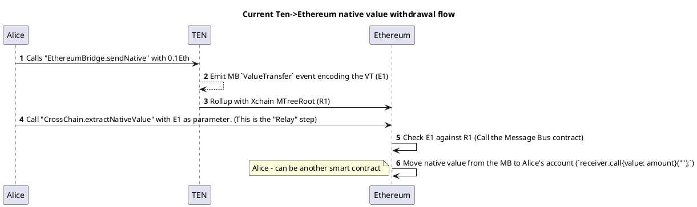
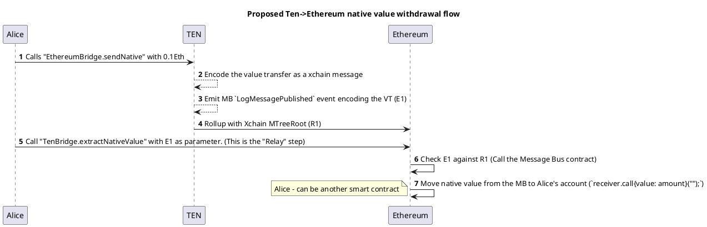

# Proposal for Message Bus native ETH handling

In the current implementation we have a Message Bus (MB) that acts as:

1. A transport layer between Ten and Ethereum of generic messages of the form:
```solidity
    event LogMessagePublished 
    (
        address sender, 
        uint64 sequence, 
        uint32 nonce, 
        uint32 topic, 
        bytes payload, 
        uint8 consistencyLevel,
    );
```

where the `payload` is the message arbitrarily encoded by the top-of-stack bridge.
For example an "ERC20" transfer command to be executed by the ERC20 contract.

2. A "native ETH bridge" between Ethereum and TEN.

The MB owns native ETH on the Ethereum side and will dispense it to the receiver when receiving a message like this:
```solidity
    event ValueTransfer
    (
        address indexed sender,
        address indexed receiver,
        uint256 amount,
        uint64 sequence
    );
```
On TEN, the MB does not own ETH, but the MB is a special "System contract", and the platform itself mints and burns ETH 
on messages such as this. 




## Requirements

1. Deposit and Withdraw native ETH into EOA.

2. Deposit and Withdraw native ETH into smart contracts by calling custom functions.
   - This is required by liquidity bridges. (Stefan - proof?)
   - Currently, we don't support it. (Stefan - or do we?)
   - Authenticate the "sender". The receiving SC needs to know who or what is sending this value. (Stefan - currently how do we achieve this?)

# Proposal 

The proposal has two main differences

1. Move the native value on the L1 from the MB to the "Reference Bridge" (TenBridge)
2. Remove the ``ValueTransfer`` and encode the value transfer on top of  ``LogMessagePublished``

The native value bridge will become a top-of-stack implementation from the point of view of the MB.
The MB will only be responsible with the transport layer.




The ``LogMessagePublished.payload`` contains the receiver and the amount.

Stefan
- why is this not authenticated