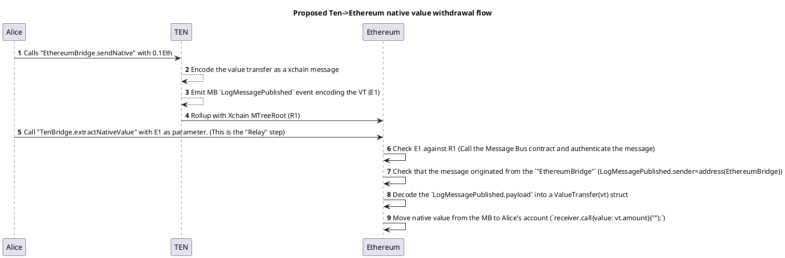

# Proposal for Message Bus native ETH handling

In the current implementation we have a Message Bus (MB) that acts as:

1. A transport layer between Ten and Ethereum of generic messages of the form:
```solidity
    event LogMessagePublished 
    (
        address sender, 
        uint64 sequence, 
        uint32 nonce, 
        uint32 topic, 
        bytes payload, 
        uint8 consistencyLevel,
    );
```

where the `payload` is the message arbitrarily encoded by the top-of-stack bridge.
For example an "ERC20" transfer command to be executed by the ERC20 contract.

2. A "native ETH bridge" between Ethereum and TEN.

The MB owns native ETH on the Ethereum side and will dispense it to the receiver when receiving a message like this:
```solidity
    event ValueTransfer
    (
        address indexed sender,
        address indexed receiver,
        uint256 amount,
        uint64 sequence
    );
```
On TEN, the MB does not own ETH, but the MB is a special "System contract", and the platform itself mints and burns ETH 
on messages such as this. 


## Requirements

1. Deposit and Withdraw native ETH into EOA.

2. Deposit and Withdraw native ETH into smart contracts by calling custom functions.
   - This is required by liquidity bridges, who are DAOs that have to pay into a counterpart crosschain smart contract.
   - Currently, we don't support it. We could in theory by adding a second Proof.
   - Authenticate the "sender". The receiving SC needs to know who or what is sending this value. (Stefan - currently how do we achieve this?)

# Proposal 

The proposal has two main differences from the existing implementation.

1. Move the native value held on the L1 from the MB to the "Reference Bridge" (TenBridge)
2. Remove the ``ValueTransfer`` and encode the value transfer on top of  ``LogMessagePublished``

The native value bridge will become a top-of-stack implementation from the point of view of the MB.
The MB will only be responsible with the transport layer.




The ``LogMessagePublished.payload`` is a serialised
```solidity   
    struct ValueTransfer {
        uint256 amount;
        address recipient;
    }
```

The ``TenBridge`` contract living on Ethereum, that owns all the native ETH can check the following when Alice attempts to withdraw funds:
1. That the xchain message she presents is valid (by checking the Mtree) and not consumed already.
2. That the message originated from the TEN ``EthereumBridge`` contract.

Note: In this version we do not support: ```receiver.call{value: vt.amount}(calldata);```
We only support plain value transfers.

Stefan
- why is this not authenticated