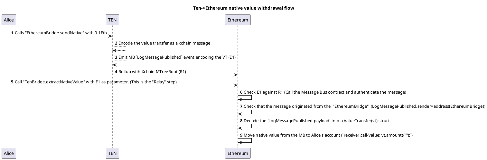
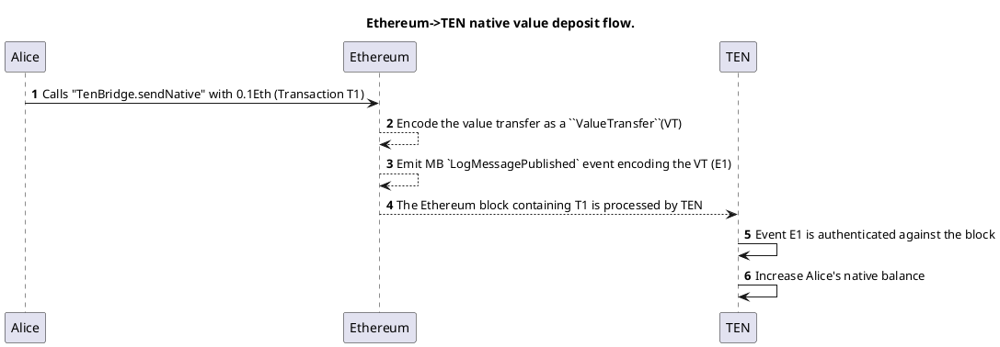

# Solidity smart contracts

This folder contains various smart contracts deployed on either Ethereum (the L1) or TEN (the L2).
The contracts are organised by responsibility.

## - common

Basic functionality and data structures used across functionality.

## - l1_management 

Set of contracts deployed to Ethereum that manage the state of the TEN network collectively called the "Management Contract".
This is the main entry point into TEN.

The "Management Contract" is composed of: 
- configurations (`NetworkConfig.sol`): advertising point for the important addresses and configurations. 
- network management (`NetworkEnclaveRegistry.sol`): responsible for managing the network secret and holds a list of all nodes which have the secret. It is the Source of Truth(SoT)  for the node that functions as a sequencer.
- data availability (`DataAvailabilityRegistry.sol`): manages “Rollups” which are data structures with metadata and an encrypted blob representing L2 transactions.
- cross chain admin (`CrossChain.sol`) - the finality of cross-chain messages depends on the metadata published in the DA layer.  

## - cross_chain_messaging 

A generic message bus implementation which has both Ethereum support and TEN platform support.
This cross chain messaging protocol is intended to be used by top-of-stack bridges.

The TEN platform understands the `IMessageBus` interface and executes the cross-chain logic in real time when the L1 blocks are created.

On Ethereum, the messages are submitted by TEN as a MTree root, which is "finalised" based on the DA. A relayer is responsible for presenting the actual message and executing it.    

This is the original design: https://github.com/ten-protocol/go-ten/blob/main/design/bridge/bridge_design.md
(note: the current implementation differs slightly from the design)

## - reference_bridge

TEN-Ethereum ERC20 and native ETH reference bridge implementation on top of the native cross-chain protocol. 

## - system 

The TEN protocol can be extended with “System Contracts” (SC), smart contracts deployed automatically at a well-known address.

System contracts can only be called by the platform using “synthetic transactions”(ST). 
STs are re-created by each node based on the current context, they are not signed, and the “from” address is set to the address of the system smart contract. (This avoids clashes and can be easily checked in the smart contract.)

Currently, we support the following SCs:

### TransactionPostProcessor

This is a system contract called before a batch is sealed. It receives all user transactions and can perform any custom logic. 
Any logic can be registered only by the platform.

For example, it can be used to reward user activity, by awarding tokens based on custom rules. It can also be used for revenue sharing with dApps.

Note: in a future phase, the ability to register logic has to be decentralised.

### PublicCallbacks

The PublicCallbacks contract provides a mechanism for registering and executing callbacks in a gas-efficient manner. It is designed to be used by contracts that need to hide their gas cost whenever executing something and make the state change immutable if proxied.

#### Key Features

- Register callbacks with associated value for gas payment
- Automatic gas refunds for unused gas
- Ability to reattempt failed callbacks
- Gas-limited execution to prevent abuse

#### Usage

Any contract can call `registerCallback` on the well known SC address. The callback is built from the msg.sender and encoded data to be passed to the msg.sender when doing a callback. The value paid for is converted to gas and refunded if unused. We use the base fee at the time of registration to calculate the gas refund, so there is no issue of the price changing between registration and execution. Execution also uses no baseFee unlimited call.

#### Internal Implementation

The contract uses a queue made out of a mapping and two uints. One points to where callbacks are added and the other lags behind pointing to the oldest callback.
The synthetic call DOES NOT fail if the underlying callback fails. Instead for now it gifts the stored value to coinbase and does not delete the callback, allowing for reattempting externally with whatever gas chosen. This might be a bit of a security risk, but its a failsafe as contracts normally do not have custom recovery logic if a callback fails.

### Cross-chain Fees

This is a very simple (first version) mechanism to configure pricing for cross chain messages.

## ten_erc20 

The ERC20 TEN token deployed on Ethereum.

## testing 

Various utilities used for testing.

# Compiling

You can use `npx hardhat compile` in order to produce the artifacts for this smart contracts. The results should be generated into
`contracts/artifacts`

# Dependencies

`import "@openzeppelin/...` is enabled using a remapping to the module downloaded by npm under `../node_modules`. This also means that the version of it is maintained in `../package.json`. Notice that the version should be fixed on a concrete release like this `4.5.0` rather than using matchers `^4.5.0` in order to avoid getting unwanted updates.

