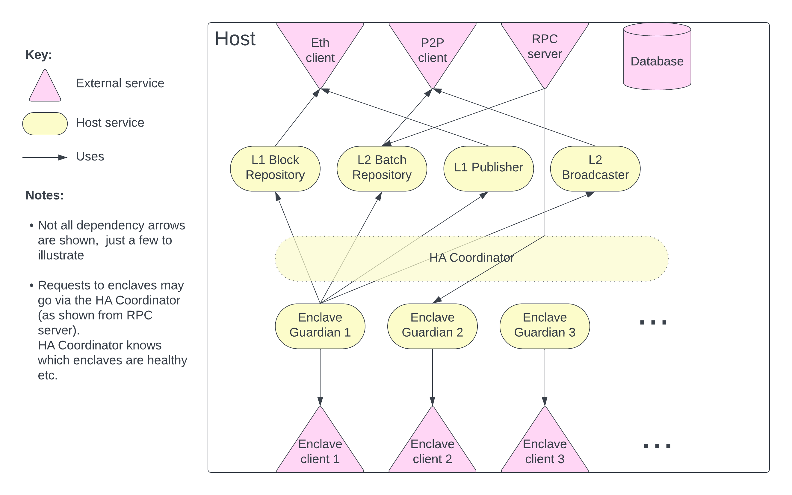

# TEN design

## Scope

The purpose of this document is to describe aspects of Ten's technical design that are not addressed in the 
[TEN whitepaper](https://whitepaper.ten.xyz/).

## Overview

The following diagram shows the key components of an TEN deployment:

The Ethereum node and Ethereum chain components shown in this diagram are developed and maintained by third-parties. 
The following additional components must be developed:

* **The enclave:** The trusted part of the TEN node that runs inside a trusted execution environment (TEE)
* **The host:** The remainder of the TEN node that runs outside the TEE
* **The TEN management contract:** The Ethereum mainnet contracts required by the TEN protocol, described 
  [here](https://whitepaper.ten.xyz/ten-whitepaper/l1-contracts)
* **Client apps:** Applications that interact with the TEN node (e.g. TEN wallets)

## Host/enclave split

The node is divided into two components, the host and the enclave. Wherever reasonable, node logic should be part of 
the host rather than the enclave. This has two benefits:

* It minimises the amount of code in the 
  [trusted computing base (TCB)](https://en.wikipedia.org/wiki/Trusted_computing_base)
* It reduces churn in the TCB, reducing the frequency of re-attestations

The host and the enclave are two separate OS processes, rather than separate threads in a single process. This is 
because our initial target TEE, [Intel SGX](https://en.wikipedia.org/wiki/Software_Guard_Extensions), requires the 
TEE to execute as a separate process.

The host and the enclave communicate via RPC, using the [gRPC](https://grpc.io/) library. gRPC was selected as it is 
open-source (Apache 2.0) and has broad adoption.

For simplicity, this transport is not authenticated (e.g. using TLS or credentials). One possible attack vector is for 
a _parasite_ aggregator to only run the host software, and connect to another aggregator's enclave to submit 
transactions, in order to economise on operating costs. To avoid this scenario, the enclave is designed to have full 
control over which account receives the rollup rewards, meaning that a would-be parasite aggregator does not receive 
any rewards for acting in this manner.

To reduce coupling, the enclave process will be monitored and managed by a supervisor, and not by the host process.

## Host design

The host has a lot of responsibilities, including:
- serving requests for data and transaction submissions
- feeding data to the enclave to keep it up-to-date with the L1 and L2 networks
- publishing secret request/responses and (for the sequencer) rollups to the L1 network
- receiving and publishing TEN data (e.g. batches and mempool transactions) with peer nodes
- managing failover and recovery for the enclave for high-availability (HA) nodes

The host will be organised with a variety of services to manage these responsibilities.

The following diagram shows a high-level view of the main services involved:

