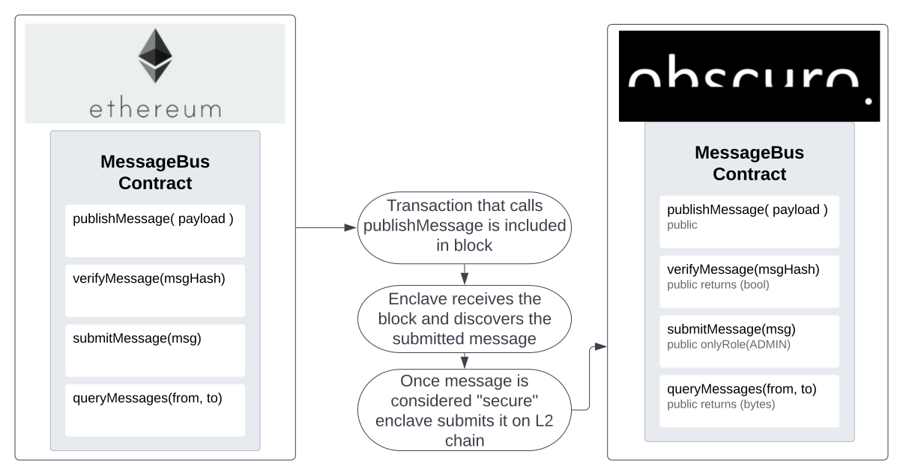
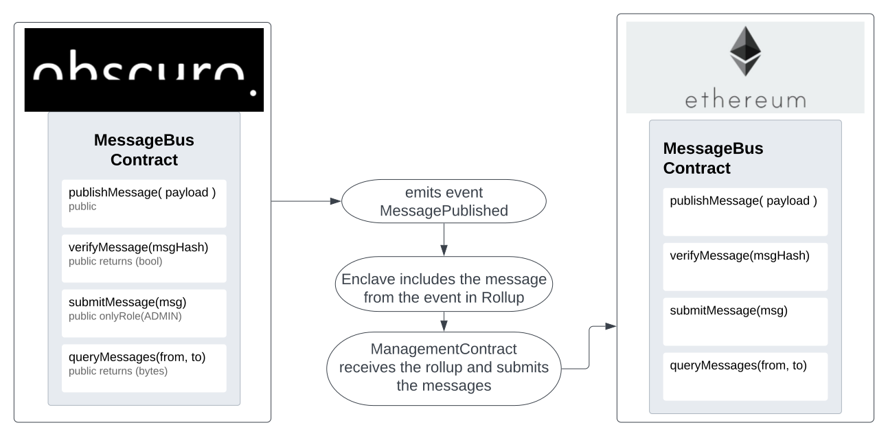
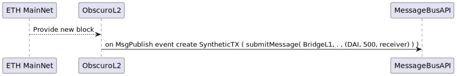
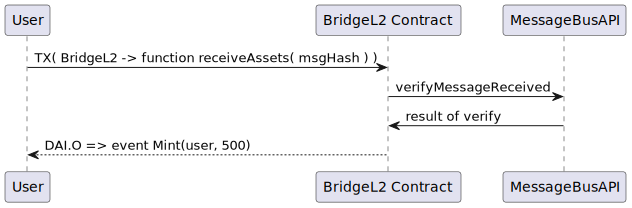

# TEN Cross Chain Messaging And Initial Bridge - Design Document

We want to expose a system API that allows any developer to come and build a bridge on Ten. We also want this API to support all types of well known bridges - wrapping assets, liquidity bridges, etc. And ideally we want the system API to further allow even more exotic type of apps - providing randomness to the L1, hidden game state and anything other that can be enabled as a cross chain application!

With the API we will build an initial bridge that wraps assets and might progress this further.

The API design proposal is inspired by the [Wormhole protocol](https://wormhole.com/). The idea is we would allow for authenticated messaging between Layer 1 and Layer 2 on TEN through a smart contract API available on both layers.
It will be provided by two smart contracts deployed on network creation on both layers. 
These contracts will be owned by the ManagementContract and the enclave on their respective layers.


## Requirements

1. **High Level Requirements**
  * The TEN platform provides On-Chain system APIs that allow dApp developers to build cross-chain bridges and applications.
  * Users should be able to transmit authenticated data between L1 & L2. Example Message:
    ```json
    { 
      "message": "I've locked 25 tokens from address 0x5adaf", 
      "from": "0xLockContract", 
      "chainId": 1 
    }
    ```
  * As an L2 developer I want to be able to query specific message topics coming from specific addresses.
  * The TEN gas calculation should include the L1 fees of submitting a message that originates on the L2. Users should fully cover the storage fees and the Rollup publisher should not incur any financial loss.
  * The messaging and bridge are decentralized as much as possible.
  * Block reorganizations should have no impact on the security of the messaging protocol and the downstream apps that use this protocol.


2. **Bridge Requirements**
  * The reference bridge contracts should be completely ordinary and separate from the management contract; The API should expose all the messaging pieces of information required in order to build the bridge independently from Ten
  * The bridge will have an asset whitelist controlled and configured by the management contract. Later this will be managed by the TEN DAO.
  * Assets and their wrapped L2 counterparts should be mapped and exposed for querying.
  * Bridge functionality should be able to use the [pull payment](https://docs.openzeppelin.com/contracts/2.x/api/payment#PullPayment) design. 
   > If any current dApps want to extend or port their functionality on TEN then it should be possible for them to do it without collaborating with anyone else 

## Scope
* Messaging architecture between TEN and Mainnet Ethereum.
* Basic Bridge that wraps assets
* Primitive fees implementation

## Assumptions

1. Fees
   * Big assumption - there will be a way to pay for bridge services/messaging in TEN without incurring losses in ETH on the layer 1 side.
   * The TEN DAO will be able to configure properties for the messaging part of the protocol and accurately estimate the `gas costs` of storing data without losing too much on `gas price` spikes.
2. Finality
   * The management contract will be responsible for not exposing data that has not been finalized. This means that it should have first gone through the challenge period.
   * The Rollup protocol will ensure the L1 blocks being consumed by the enclave and the resulting synthetic transactions are always bound to the blocks generating them.
   * TEN has fast finality over the transaction ordering rather than the results. When a deposit gets reorganized the results on TEN L2 should reorganize too if depending on it. 

## Modifications

The Rollup headers right now are assumed to include withdrawal instructions. These instructions will change to generalized messages. Those messages might be withdrawal instructions or anything else.


## Definitions

* `System contract` - A contract that is deployed by the TEN protocol when the Layer 2 network is created. System contracts serve the purpose of providing system API access on-chain. 

## MessageBus Design - TEN cross-chain data transmission 

The `MessageBus` will be deployed as a [`Proxy`](https://docs.openzeppelin.com/contracts/4.x/api/proxy)

**The interface of the MessageBus will look like this:**
```solidity
interface IMessageBus {
    function publishMessage(
        uint32 nonce,
        bytes memory topic,
        bytes memory payload, 
        uint8 consistencyLevel
    ) external payable returns (uint64 sequence);

    function verifyMessageReceived(
        address      sender,
        uint64       sequence,
        uint32       nonce,
        bytes memory topic,
        bytes memory payload
    ) external returns (bool);

    function submitOutOfNetworkMessage(
        address      sender,
        uint64       sequence,
        uint32       nonce,
        bytes memory topic,
        bytes memory payload
    ) external;

    function queryMessages(
        address      sender,
        bytes memory topic,
        uint256      fromIndex,
        uint256      toIndex
    ) external returns (bytes [] memory);
}
```

The messaging API will be provided by the new `MessageBus` system contract. This contract's interface will be available for L1 and L2. This contract needs to be [`Ownable`](https://docs.openzeppelin.com/contracts/2.x/access-control) or [`RBAC`](https://docs.openzeppelin.com/contracts/2.x/access-control#role-based-access-control) based as some of the functions should only be callable from an administrative trusted address.
This trusted address can either be the `Enclave` or the `ManagementContract`. As a system contract, the `MessageBus` should be created during the network bootstrap process.


### Publish Message

Taking inspiration from the [Wormhole contract](https://github.com/wormhole-foundation/wormhole/blob/dev.v2/ethereum/contracts/Implementation.sol) the main method of transferring information across networks would be the `publishMessage` function. For us, it will look like their definition with added `topic`.

```solidity
function publishMessage(
        uint32 nonce, //deduplication/uniqueness mechanism
        bytes memory topic,
        bytes memory payload,
        uint8 consistencyLevel //number of confirmation blocks to wait for
) public payable returns (uint64 sequence) {
    // check fee
    require(msg.value == messageFee(), "invalid fee");

    sequence = useSequence(msg.sender);
    // emit log
    emit LogMessagePublished(msg.sender, sequence, nonce, topic, payload);
}
```

Any contract or user can call the `publishMessage` function. Any message passed will be bound to its sender so contracts cannot simply impersonate one another. As messages are not stored, but rather emitted as events all of our synchronization behind the scenes will happen inside of the `Enclave`. It will be subscribed to those events. 

`nonce` is a deduplication mechanism that enables uniqueness between two identical payloads on the same topic. An example is when the message __"I've received 50 USDC tokens from 0xBob"__ is received twice with different nonces, this should mean those were two different deposits. 

`consistencyLevel` is a mechanism to introduce delay before the message is considered valid. The platform will only expose the message after the block producing it is confirmed by blocks equal to the `consistencyLevel`

> **_NOTE:_**  `consistencyLevel` is only required if TEN does not reorganize when L1 deposits reorganize. In other instances it can be set to 0 or 1. There is however another use case for it described in [Security](#MessageBusSecurity).


### Verify Message

This function checks if such a message has been submitted from the other network to the `MessageBus` contract and is useful for pull semantics. Its interface will look like this:

```solidity 
function verifyMessageReceived(
        address      sender,
        uint??       sequence,
        uint32       nonce,
        bytes memory topic,
        bytes memory payload
) public returns (bool)
```

Internally, the function will hash the message and compare it with the result of the key in `receivedMessages` map. If the map contains a `true` under this key, then the message has been received by this contract and `verifyMessageReceived` will return true. This is useful as a cheap-ish way to verify something has happened by utilizing the end user's client (or browser) as the transfer mechanism for the full message.  


### Submit Out Of Network Messages

This is the smart contract function which is used to store messages sent from the other linked layer. The function will be called by the `ManagementContract` on L1 and the `enclave` on L2. It should be access controlled and called according to the `consistencyLevel` and TEN platform rules.

```solidity 
function submitOutOfNetworkMessage(
        address      sender,
        uint??       sequence,
        uint32       nonce,
        bytes memory topic,
        bytes memory payload
) public onlyRole(ADMINISTRATOR|OWNER)
```

This function should not be callable by any users or contracts unless they have the `ADMINISTRATOR` role or are the `Owner` of the `MessageBus` contract. Along with those requirements, on the TEN layer 2, there is an additional security measure - Any incoming transaction to this function is blocked, even if it is coming from an address that has the correct role. The protocol will block transactions that do not originate from inside of the enclave due to consuming L1 blocks. This means that even if the enclave gets hacked and the keys leak the verifiers will block withdraws.

When called, the function should store the message indexed in storage - map of `senders` that contains a map of `topics` which points to array of `messages` should be sufficient. 
Along with it, the hash of the whole message should be used as a key to store a message received flag inside the map `receivedMessages`. This map enables quick verification that a message is valid and received.

### Query Messages

This function allows querying messages on a topic, by a certain user. 

```solidity 
function queryMessages(
        address      sender,
        bytes memory topic,
        uint256      fromIndex,
        uint256      toIndex,
) public returns (bytes [] memory)
```

This function should return all the messages between the requested `fromIndex` and `toIndex` of the array storing the submitted messages. The array can be found when going through the map of `senders` under the concrete `topic`. It is a more expensive way to get messages on-chain without relying on users to ferry them around. 

### MessageBus Internal workings - L1 to L2

When a block from `L1` is processed by the `enclave` and transactions inside of it result in `MessagePublished` events, the `enclave` will submit them as messages to the inbox of the `L2` contract. This enables the `L2 smart contracts` to use/consume messages from `L1`. 



> **_NOTE:_** The enclave should not accept user transactions to system contracts. Only internal/synthetic transactions should be able to call the system functions!

### MessageBus Internal workings - L2 to L1

When a transaction on the `L2` results in `LogMessagePublished`, the event will automatically be added to the `Rollup header` by the `enclave`. Then the management contract will submit them to the `MessageBus` or they will directly be.



> **_NOTE:_** **The messages must not be accessible unless** the challenge period has passed! On top of that the block where the message is submitted to L1 must have confirmations equal to `consistencyLevel` before the message is released. Those are simply counted on-chain as "confirmations" is meaningless for TEN L2.  

### Alternative approaches

1. TEN only ever pushes the hash of the message. The user has the responsibility of providing the full message which will only be accepted if it matches one of the hashes, if necessary.
  * This simplifies gas cost calculations, but the problem described in the `Fees` section remains.
  * Contracts can hash their messages before passing them to the `MessageBus` and achieve nearly the same outcome if they want to. 
2. TEN only pushes to L2. Messages on L1 are provided signed by the enclave through an RPC and the MessageBus contract verifies that they have been signed by a correct enclave-owned key. 
  * This disabled the option to read messages and ordering becomes problematic.
  * The API is different between layers, which might end up being a bad UX.
### Fees

When publishing a message on the TEN L2, storing the message will have a direct cost to the `Sequencer` who is publishing the Rollup in the form of gas. In order to channel this cost to the user who is publishing the message we would need some configurable properties.

**Assumption: TEN DAO** will vote and set the following properties:
* `fixedMessageStoringCost` - this is the gas cost for storing the fixed-size properties of the message
* `dynamicCostPerByte` - this is the gas cost per byte for storing the dinamically sized data - `bytes payload`, `bytes topic` 

> **_NOTE:_** This whole section might change based on the outcome of the TEN fees & rewards design. It only outlines a potential solution.

The wormhole implementation requires that a fee is paid for each published message. This is something we should implement exactly as is to prevent people from spamming huge messages on L2 for a little gas cost that results in TEN having to pay for them being submitted to the L1!

The problem we will experience is that the native currency on TEN L2 will be different from the native currency on L1 - ETH. This means `ETH : TEN` pair volatility might result in losing money on gas costs.

I see a couple of possible solutions to this:
1. Collect the fees in `WETH` when calling `publishMessage`.
    * This is a bad user experience. Anytime we want to withdraw we must source `WETH`
    * It does protect us from losing money when publishing rollups, however.
2. Using a DEX when it becomes available on Ten's L2 we can exchange TEN tokens for the required amount of `WETH`.

An additional insurance fee might be required. It is described in [Security](#MessageBusSecurity)


### <a name="MessageBusSecurity"></a> Security 

The security of the `MessageBus` is maintained by the `ManagementContract` and the enclave. When the `MessageBus` is secure, then all the downstream apps are secure too. **The maximum achievable security depends on the type of finality the TEN L2 has.** 

 * For probabilistic finality - We can be fully secure as L1 block reorgs will reorganize us too.
 * Fast & hard finality - Block reorgs can lead to instances of the enclave having delivered a message that got thrown away, even when accounting for confirmations.

`consistencyLevel` should be used to prevent opportunistic attacks in protocols that use messages to transfer financial value. For example if the `consistencyLevel` is equal to `0` and a user bridges some tokens which he later on trades he would still have the possible chance of canceling the "final" trade. He can do this by submitting a conflicting transaction (same `tx_nonce` as the transaction that bridged assets ) on the `L1` which always has chance of going in before the other one in cases of block reorganizations. This statistical probability can be exponentially reduced by increasing the `consistencyLevel` as there will be more blocks confirming his initial bridged asset and in turn locking it down.

**__Example cross-chain messaging and reorganization:__**
> A user submits a transaction to bridge assets on `L1` and this transaction results in a message published from L1 -> L2. Immediately the user attempts to mint the equivalent assets from the bridge on `L2` using the message. Then the user bridges them back to the `L1`. The user transaction is immediately captured in a rollup which gets sent to `L1`. **In the meantime `L1` has experienced an reorg** and the deposit is no longer inside. 

When the rollup reaches the management contract either one of those must be true:
* The rollup must be bound to a specific `blockhash` for `block.number`. This would mean that if it contains synthetic transactions which were caused by messages that no longer exist, then the rollup will be rejected as the `blockhash` would be different for the `block.number`. The only way to ever have the same blockhash is to have the same state, transactions and order over them.
* The rollup must be bound to a specific `MessageBus` state. Another approach is to have the `MessageBus` contract chain-hash the published messages it receives and the `ManagementContract` verifies if incoming rollups point to a historic or current hash of the `MessageBus`.

This diagrams should help illustrate the control flow:


**If the canonical block remains the one without the message, then the enclave should regenerate a rollup from there by reapplying the transactions!**

> **_NOTE:_** The following section is only for fast finality that does not support block reorgs


<details>
  <summary> More on hard & fast finality </summary>

**L2 to L1 Delivery** - The `ManagementContract` needs to ensure that information is exposed through the APIs and/or messages are submitted only after the challenge period of a rollup has passed. This means that anything that shows up there will be final.

**L1 to L2 Delivery** - We need to implement a block confirmation mechanism to secure the `MessageBus` - when the enclave encounters the `LogMessagePublished` it will only create a synthetic transaction for it on the L2 once the required `consistencyLevel` is achieved. Otherwise if we publish the message instantly it might end being fake as the `L1` event that caused it has been reogranized.

We can also engineer a mechanism to insure delivered messages:
* When fees are collected for `publishMessage`, part of those fees is funneled to an insurance pool.
* When a message that has been published gets reorganized the TenDAO can pay for the financial loss from the insurance pool.

> **_NOTE:_** The maximum possible payout should always be less than the penalty for PoS slashing on MainNet. This ensures there is no profit to attacking and claiming insurance.  

</details>


## Bridge

The actual bridge will be deployed as a [`Proxy`](https://docs.openzeppelin.com/contracts/4.x/api/proxy).

The initial version of the bridge implementation is going to create wrapped versions of ERC tokens. The bridge will hook into the `MessageBus` API in order to provide its functionality.

It will have the following functions:
* ```solidity 
  function bridgeAssets(address erc20token, uin256 amount) public
  ```
* ```solidity
  function receiveAssets(bytes calldata memory) public
  ```
* ```solidity
  function bridgeETH() payable public //this function will only be available on L1 as L2 will only have WETH
  ``` 
* functions to interact with OpenZeppelin's whitelist.

It will also have the following properties required for the OpenZeppelin whitelist to run. The whitelist is discussed in detail further down this document.


### Cross-chain messages definitions

There will be the following topics initially: 
* `Transfers` - messages here will be for users transferring value across chains.
* `Administration` - messages here will be for administrative changes; Voted upgrades, and whitelist changes.


### Transfers

**Diagram of the bridge process that happens on the Ethereum MainNet**


---

**Diagram of the bridge process that happens on Ten's Layer 2 when a deposit is created**


**Diagram of the process to withdraw the assets from the bridge contract on Ten's Layer 2**


The API to transfer assets from the perspective of the user is the same on both layers. The process is as follows:

1. User calls `function bridgeAssets(address erc20token, uint256 amount, address receiver)` after approving allowance for the address of the bridge.
2. The bridge ensures that the `erc20token` is inside of the whitelist.
3. The bridge ensures that `msg.value` is `0` or reverts.
4. The bridge transfers the assets to itself - `IERC20(erc20token).transferFrom(msg.sender, address(this), amount);`
5. If the `transferFrom` call succeeds the bridge calls `publishMessage` on the `MessageBus`. The message passed to `publishedMessage` must include the amount, the token type, and who transferred it.
6. The bridge emits an event containing the published message along with the returned sequence number from the MessageBus.
7. The user sends a transaction to the other layer that calls the `function receiveAssets(bytes calldata message)`
8. The bridge contract on the other layer verifies that such a message was received by calling `verifyMessageReceived` on the `MessageBus`
9. If verification is successful, the bridge checks that the message has not already been consumed and marks it as such, and then transfers the tokens to the corresponding address.


> **_NOTE:_**  To send raw ETH users must first call into `bridgeETH`. This function internally will convert the `msg.value` to WETH and then internally call into `bridgeAssets` with the `receiver` being equal to the `msg.sender` and the amount being equal to the WETH converted. 


### Whitelist

The whitelist will be controlled by the DAO. This will be done by adding  OpenZeppelin `RBAC` to the functions managing the whitelist. As for the actual whitelist we can use OpenZeppelin's [`WhitelistedRole`](https://docs.openzeppelin.com/contracts/2.x/api/access#WhitelistedRole). 

**When a contract is added to the whitelist**, the bridge calls `publishMessage` on the `MessageBus`. In turn, there should be another call on L2 that instructs the bridge over there to create a wrapper contract upon verifying the message.


### Differences between L1 and L2 for the bridge contract implementation

1. On layer 1,
    *  `receiveAssets` makes the bridge approves allowance/transfers to the receiving address.
    *  `bridgeAssets` makes the bridge transfer assets to itself.
2. On layer 2
    *  `receiveAssets` makes the bridge mint tokens to the receiving address. The bridge can do that as it owns the ERC20 wrapper contracts.
    *  `bridgeAssets` makes the bridge burn wrapped assets from the address of `msg.sender` instead of transferring them.


### Bridge Security

The security of the `MessageBus` guarantees that downstream dApps using it are also secure as far as cross-chain messaging is concerned. One aspect however that needs to be managed by applications is marking messages as consumed. If this is not done for the bridge then users can simply run the same message again through `receiveAssets` to mint more. 


## Decentralization

The `MessageBus` and `Bridge` contracts sit on-chain and inherit the least common denominator properties of both TEN and Eth. If TEN is decentralized then the Bridge and MessageBus will be too.

