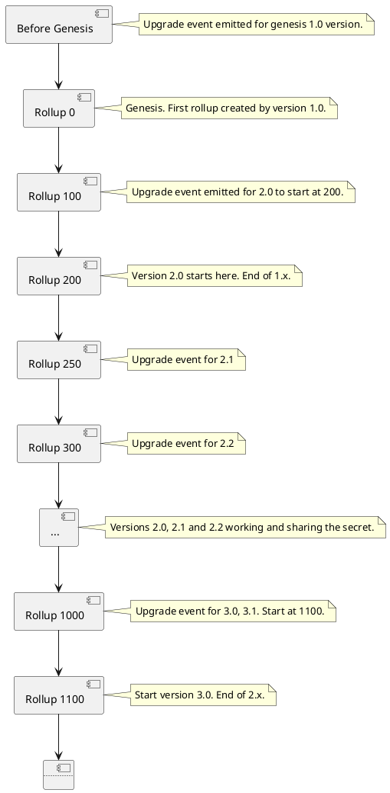
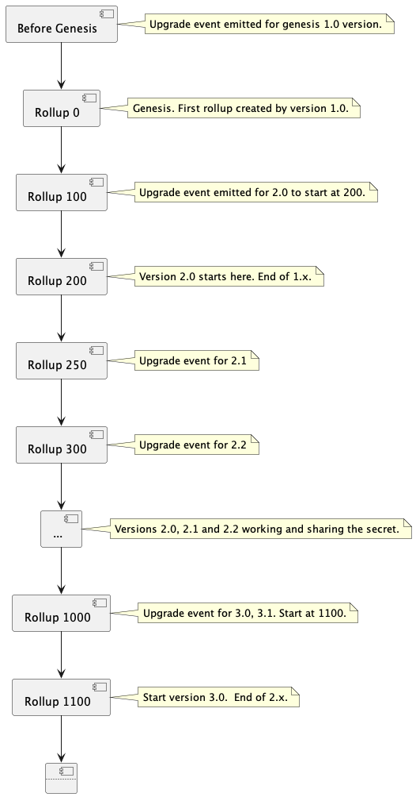
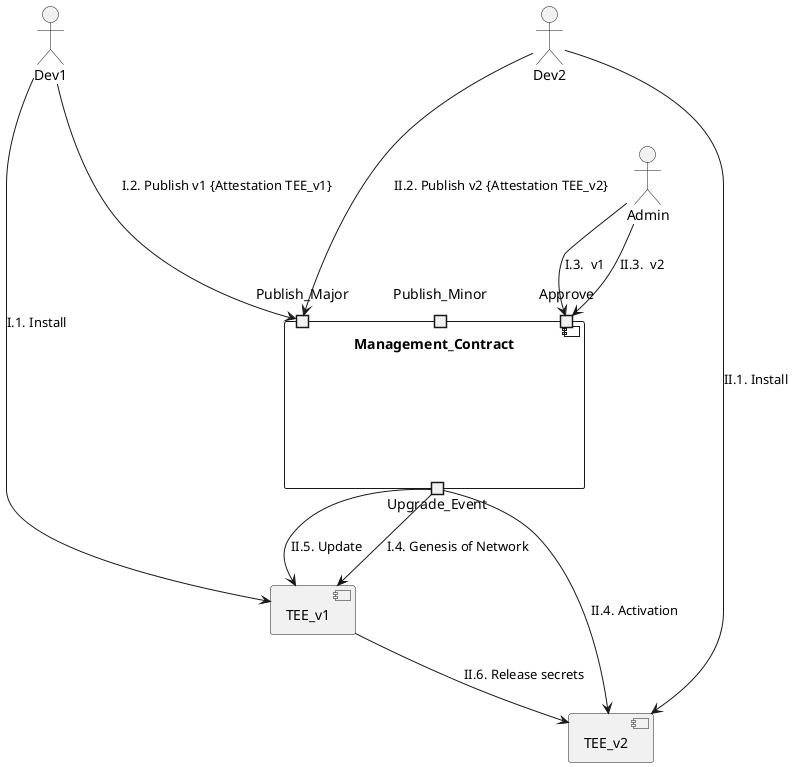
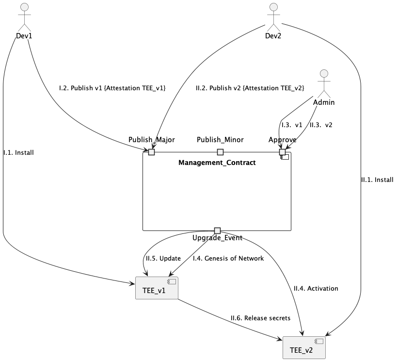

# TEN Upgrades

This design covers the operational aspects of upgrading Ten.
The mechanism by which the community validates an upgrade is covered in the [TEN source of truth](./Source_of_truth.md) document.

We'll start by identifying the types of scenarios that will require a software upgrade, and next, we'll propose the
procedures and the technical changes required to achieve them.

Note: This document is written with the single aggregator model, but it also applies to the decentralised POBI.

## Prerequisites

Upgradeability is a very complex topic. We'll start by listing the concerns specific to TEN and by creating
some useful classifications to be able to reason about the problems.

### TEN secrets

There are two main secrets on an TEN node :

1. The master seed, aka "the shared secret", is the basis of all communication between enclaves, users and enclaves, and data availability on Ethereum.
2. The key for connecting to the local database, which lives in its enclave.
   - Note: TEN uses EdgelessDB, a modified MySQL running inside an enclave. The connection to the database is made using a key generated during the setup phase of the enclave. The EdgelessDB enclave ensures that only the owner of that key can read data.

Access to these secrets will allow attackers to read private user data.
Both secrets are sealed locally with a key derived from the current measurement of the enclave.

We'll see that during the upgrade, the secrets will be handed over to another enclave that is able to prove attestation
against a whitelisted upgrade. Handing over the secrets means encrypting them with the attestation key of the new
version. 
Note that the database secret is containing a key that allows a TLS connection to the database. The new enclave
can connect to the same database if it passes the attestation requirements it has hardcoded.


### Random notes

- The privacy of the ledger data is guaranteed by the security of the local secrets.
- The main reason for a "privacy" upgrade is the discovery of a vulnerability that can leak data.
- Most upgrades will hopefully be for mundane reasons such as new features or general improvements.
- TEN is an L2 with a governance mechanism on the Ethereum Management Contract (MC). The decisions made by
  the governance contract must be understood and enforced by the enclave. See more details in the "Source_of_truth.md" document.


## Upgrade reasons for Ten

1. To fix security bugs which can impact the integrity of the ledger.
1. To fix security bugs that can impact the ledger's privacy.
1. To fix non-security (usability) bugs or to improve performance.
1. To add features.
1. To fix or to improve the protocol.
1. Microcode upgrades for SGX vulnerabilities that can be fixed with a firmware upgrade.
1. CPU hardware upgrades in case the SGX vulnerability can't be fixed with software.


## Rolling out an upgrade

There are two types of upgrades in any decentralised network when considering how they can be rolled out.
This section will analyse how privacy-specific concerns fit into this classification.

### 1. Consensus upgrades

When there is a change to the format of transactions, to the data model, to opcodes or the actual consensus protocol
it means that a non-upgraded node that doesn't know about that change will not be able to function when it receives
data created by an upgraded node.

These changes can be further classified based on how the upgrade is intended to be rolled out.

####  a. "Hard" forks

This is the typical consensus upgrade where non-upgraded nodes will no longer be able to understand the new rules,
so won't be able to participate any more.
Rolling such a change to the node operators requires coordination because everyone needs to be ready when the new rules
are activated.

In Ethereum, such upgrades are triggered at a certain "block height". The node software will contain the logic for both the old
version and the new version, and it will start applying the new rules when the block height is reached.
This trick means that there is a window during which the operators can upgrade to the new version on their own time.
If they don't, then they will be left out.

Note: Sometimes, node operators don't agree with a certain upgrade and continue using the old software,
which results in an actual "fork". For example, "Ethereum Classic" after the DAO hack or the "Ethereum Proof of work" after the merge.

####  b. "Soft" forks

There is another "trick" that developers have when they want to roll out upgrades in a gradual non-invasive fashion.
They can implement the change such that the previous version does not crash when encountering data generated by the new version, for example, by assigning a new implicit meaning to an existing field.

There are multiple issues with this option. It was used mostly in the early days, but currently, the "hard fork" approach
with a block number activation date is the preferred option.

In Ten, we'll use the preferred Ethereum approach.


### 2. Local only upgrades

These are upgrades that only impact the node operator.
Like better metrics, improved RPC endpoints, better performance, etc.
This version can be installed by a node operator at any time and is optional.


### 3. Privacy related upgrades

This type of upgrade specific to TEN (or other privacy networks) is necessary to remove a side channel or another avenue where data can be leaked.

This is not a "consensus upgrade" in the traditional sense, but it has to be treated equally because if there is a single
node operator with a vulnerable version on the network, then privacy is considered compromised.
Also, users have no incentive to perform this upgrade, so it has to be enforced similarly to a consensus upgrade.

After the rollout of such an upgrade, it is mandatory to change the secrets.

Upgrading the SGX firmware or completely changing hardware falls under the same category.


## TEN architecture

In this section, we'll look at the architecture and analyse how upgrading different components fits into the above categories.


### Trusted Computing Base (Enclave, Database and SGX)

Any change to this codebase must go through the attestation whitelisting process.

Note that some changes can be "local only", such as a release containing only a performance improvement.

Note that TEN will allow multiple approved versions in the period between two block heights.

### Host

Changes to the host component will likely be for usability and performance reasons.
Some upgrades could also be consensus upgrades, for example, on a change of protocol.

### The Wallet extension

End users install this component that communicates with TEN nodes via RPC.
For a good UX, TEN nodes must be backwards compatible and support even older versions of the Wallet extension.
There must be warnings and mechanisms to help users upgrade to the latest version.


## Upgrade Process

TEE attestation verification is a complex and computationally expensive process that is difficult to implement in a smart contract.
It is more practical to limit attestation verification to external tooling and enclaves and design incentive mechanisms in the smart contract.

The management contract will not support direct attestation verification. It will instead accept and record publishing 
requests that contain attestations which will be verified by incentivised users and researchers.

The attestation for each new version of an enclave must be published, together with a link to the source code that produces that binary image.

At the end of a successful whitelisting lifecycle, the MC will produce an UpgradeEvent like this:

```
 UpgradeEvent(
   - MajorVersion   : Number       // The major version of this upgrade. 
   - MinorVersion   : Number       // The minor version of this upgrade.
   - GenesisEnclave : Attestation  // The attestation of a node installed with the new version.
   - StartAtHeight  : Number       // The rollup height from which only the new version will move forward. It can be nil if not applicable.
   - Attributes     : Map          // A map of attributes that will be understood by the current version of the enclave.  
   )
```

When `MinorVersion` is `0`, the `StartAtHeight` field is mandatory.
Each time a major version is released, it must specify the `StartAtHeight` field.
A major release is a consensus release that will rotate the master seed.

The minor versions will inherit the rollup interval.
There could be multiple minor releases for each major release, all of them perfectly compatible with each other and will share the master seed.

In phase 1, the event will be emitted when the contract administrator calls an "approveVersion" function.
This will give the upgrading power to the administrator, but in a transparent way. In phase 2, we'll implement
the decentralised mechanism described in the relevant design document.

The diagram below depicts various events happening during the normal functioning of the network.
Notice that between height 0 and 199 - version 1.x is active.
Between 200 and 1099 - version 2.x is active.
After 1100  - version 3.x is active.





Below is an operational view of the actions that the various actors in the system will perform.
Two developers (Dev1 and Dev2) will develop and publish major versions v1 and v2.
Notice that before publishing those versions, they must first install them on an enclave to fetch the attestation.

This diagram depicts the phase 1 setup where an Admin will manually whitelist that version.
And then, once the Upgrade Event is emitted and authenticated by the first version, it will release its secrets to the new version.

There are two groups of related events prefixed with roman numerals.




## Minimum viable upgrade mechanism

This section describes the minimum implementation required in phase 1.

Unlike most software that can get away with not thinking about upgrading during early development, TEE software doesn't have
this luxury.
Without a mechanism put in place in the initial release, the enclave cannot be upgraded at all because any other version will
not be able to read the data.

Upgradability in phase 1 is only a concern for the TEN enclave, as upgrading the "Host" component can be designed afterwards.

### High-level tasks

This is the list of tasks that we have to implement before the initial mainnet release to support the flow depicted in
the diagrams above.

#### Management contract

- Create the UpgradeEvent.
- Add the "Publish major" and "Publish minor" functions to publish metadata about a release.
- Add a function callable only by the admin to approve one of the published releases.

#### Enclave

1. Implement the UpgradeEvent authentication mechanism.
   - Basic logic to understand the beacon canonical chain
   - Minimal heuristics to mitigate "Weak subjectivity."

2. Implement logic to verify an attestation against the approved version based on the current rollup height.

3. Create an RPC endpoint to hand over secrets to an approved version, encrypted with the key.

4. Logic to stop operating at the block height specified in the UpgradeEvent.

The enclave must maintain an internal structure like the one below created from authenticate Upgrade Events and always
perform validity checks against all secret requests or incoming data.

```golang
   type MinorVersion struct{
       version int
       AttestationConstraints Constraints
   } 

   type MajorVersion struct{
        version int
        minorVersions []MinorVersion
        startAtHeight int
		masterSeed    []bytes
   } 
```

Note that an enclave must receive and store all the historical master seeds. As part of the secret sharing from the previous
version, it will receive the entire history of seeds. This is required to understand the data stored in the availability layer. 

#### Host level
Doesn't require any special functionality in phase 1.


### Process

1. Developer creates a new version, installs it on a TEE and obtains an Attestation Report. This is the New Enclave (NE)
1. The whitelisting of the new attestation is performed on the MC, and an Upgrade Event (UE) is emitted.
1. During normal operation, the current version of the Enclave (CE) will consume and authenticate the UE.
1. The operator will call the RPC endpoint, which will hand over secrets encrypted with the key of the NE.
The operator will present the attestation of a TEE installed with the new software. The CE will verify that attestation
against the latest UE, will encrypt the secrets with the key from the attestation, and return it.
1. The NE will start up and will run in the backwards compatibility mode until the block number mentioned in the UE is reached.
1. The CE can continue operating until the block height in the UE is reached, when it will exit. By now, it will assume that the NE has taken over.

#### The Sequencer

The sequencer will undergo the same process.
The CE will continue to produce batches/rollups until the specified block.

All the other nodes will use the UpgradeEvents to identify the sequencer between any two block heights.

In phase 1, the sequencer will always be the node that was whitelisted for both major and minor upgrades.
In phase 2, there will be a more elaborate mechanism in place.

#### The Genesis Upgrade Event

The "UpgradeEvent" mechanism can be used for the genesis as well.
The diagram shows that the first UpgradeEvent will act as the activation signal.


#### Replacing an upgrade

It is possible that a whitelisted version contains a bug which will surface when running in compatibility mode before
taking over.
If this bug does not compromise privacy, it is possible to release a minor upgrade.
However, a major upgrade must be released starting from the same block height if it compromises privacy. The logic inside the
enclave must recognise this and prioritise the latest version.


## Next phases

For simplicity and de-risking purposes, the solution proposed for phase 1 makes some tradeoffs. Mostly by centralising
some tricky aspects while maintaining transparency as much as possible.
In the next phases, we plan to decentralise all the aspects of an upgrade.


### Whitelisting the upgrade
This is covered in the [Whitelisting an upgrade](./Source_of_truth.md).
In the next stage, we will implement the mechanism based on incentives.

### Backup key
We will move to the safe mode described above and, ideally to a multi-software, multi-manufacturer setup, which will
further reduce the chance of the same error happening everywhere. 

### Joining the network 

There will be mechanisms in place to prevent users from starting a non-current version of an TEN Node.
These mechanisms are necessary to prevent exploiting of already fixed privacy vulnerabilities. 

This means that a node joining the network must do so with the latest version which must contain all the compatibility modes
to execute transactions from genesis.

It should be possible to request an encrypted database dump (checkpoint) from another node to speed up bootstrapping.
