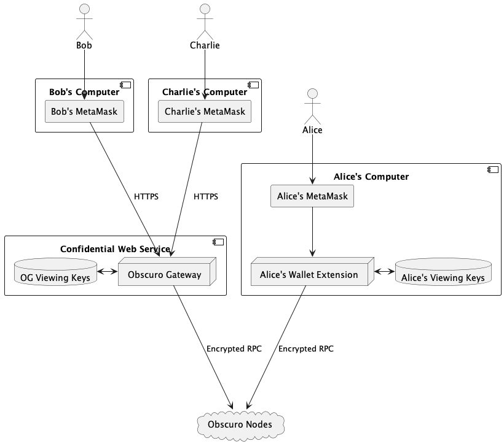
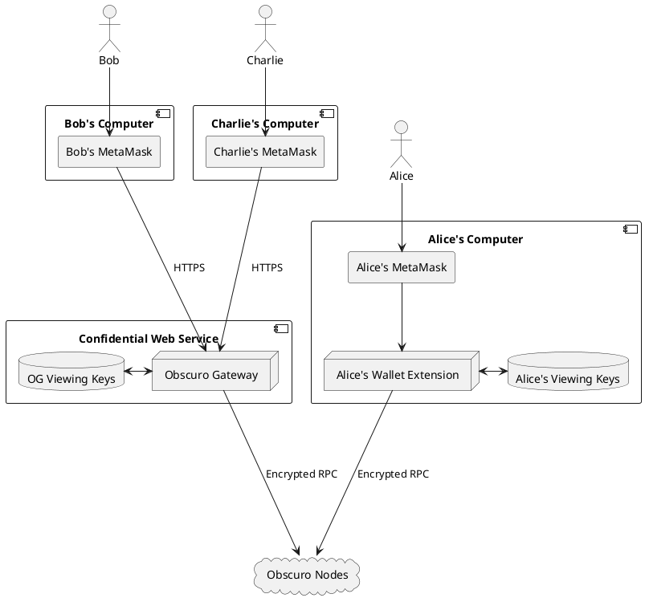
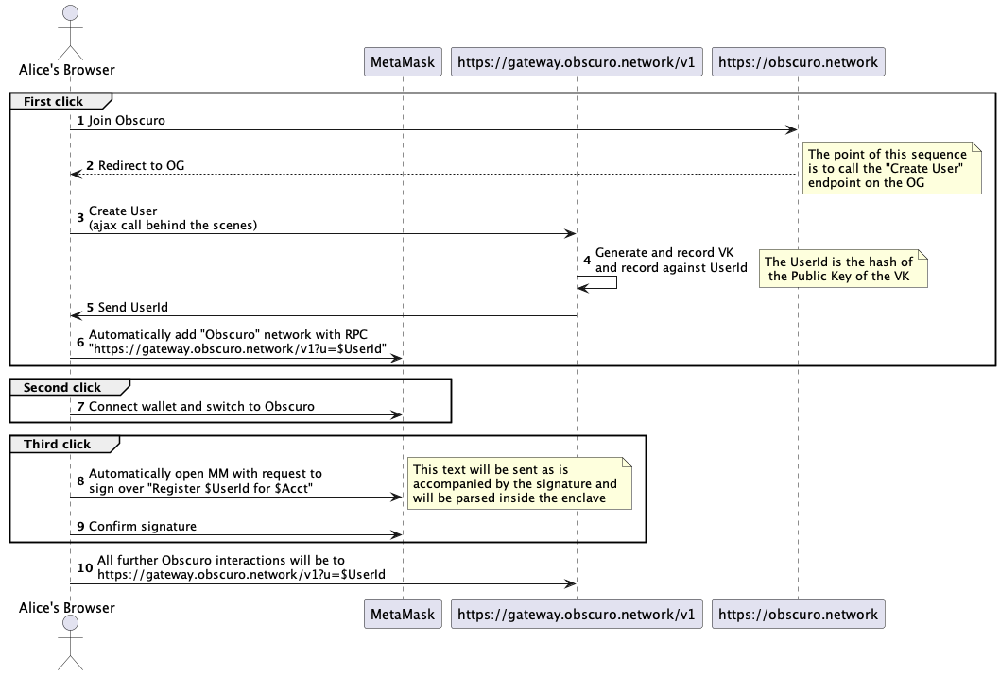
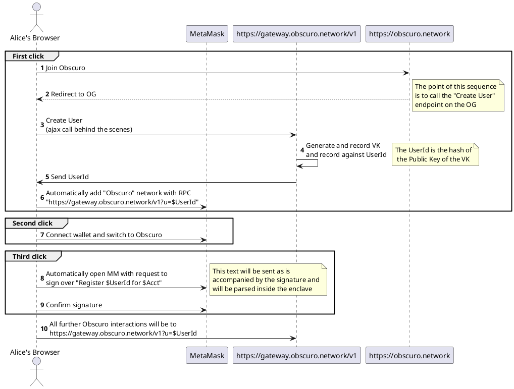

# The Obscuro Gateway - Design

The scope of this document is to design a hosted [Wallet Extension](wallet_extension.md) called the "Obscuro Gateway" (OG).

The OG will be a superset of the WE functionality, so this document will only cover the additions.

## High level overview

The OG will be a [Confidential Web Service](https://medium.com/p/983a2a67fc08), running inside SGX.

The current WE is designed to be used by a single user holding multiple addresses accross potentially multiple wallets. 

The OG must support mutiple users, each with multiple addresses. It can be seen as offering a WE per user.

The Obscuro node has no concept of "User". It only authenticates based on the "blockchain address". 
It expects to be supplied with a signed viewing key per address, so that it can respond encrypted with that VK. 

*Note that multiple addresses can share a VK.*

The role of the current WE is to manage a list of authenticated viewing keys (AVK), which it uses behind the scenes to communicate with an Obscuro node. 
The AVKs are stored on the local computer in a file.
An AVK is a text containing the hash of the public viewing key signed with the "spending key" that controls a blockchain address.

The diagram below depicts the setup once the OG is implemented.

Notice that the OG is a multi-tenant WE running inside SGX and storing the authenticated viewing keys (and other information) in an encrypted database.

## User interactions

The key reason for the OG is to allow implementing a 3-click user onboarding process.

### User on-boarding

Proposed flow:

The onboarding should be done in 3 clicks.
1. The user goes to a website (like "obscuro.network"), where she clicks "Join Obscuro". This will add a network to their wallet.
2. User connects the wallet to the page.
3. In the wallet popup, the user has to sign over a message: "Register $UserId for $ACCT"

##### Click 1
1. Behind the scenes, a js functions calls "gateway.obscuro.network/v1/join" where it will generate a VK and send back the hash of the Public key. This is the "UserId" 
2. After receiving the UserId, the js function will add a new network to the wallet.
The RPC URL of the new Obscuro network will include the userid: "https://gateway.obscuro.network/v1?u=$UserId". 
Notice that the UserId has to be included as a query parameter because it must be encrypted by https, as it is secret.

##### Click 2
After these actions are complete, the same page will now ask the user to connect the wallet and switch to Obscuro. 
Automatically the page will open metamask and ask the user to sign over a text "Register $UserId for $ACCT", where ACCT is the current account selected in metamask.

##### Click 3
Once signed, this will be submitted in the background to: "https://gateway.obscuro.network/v1?u=$UserId&action=register"

Note: Any further accounts will be registered similarly for the same UserId.

Note: The user must guard the UserId. Anyone who can read it, will be able to read the data of this user.

The ultimate goal of this protocol is to submit the "Register $UserId for $ACCT" text to the gateway, which is required by an Obscuro node to authenticate viewing keys per address.

Note: Alternative UXes that achieve the same goal are ok.

### Register subsequent addresses  

User Alice is onboarded already and has the Obscuro network configured in her wallet with a UserId.

She has to go to the same landing page as above and connect her wallet, instead of hitting "Join".
When connecting, she can choose a second account.
The page will automatically detect that it must request a signature for this account, and will open the wallet.
After signign it will submit to the server

## Multitenancy

The curent WE is single-tenant. It assumes that all registered blockchain addresses belong to the same user.

The OG will keep a many-to-one relationship between addresses and users. It will have multiple users, each with multiple addresses.

Each request to the OG (except "/join") must have the "u" query parameter. 
The first thing, the WE will lookup the userId and then operate in "Wallet Extension" mode, after loading all addresses.

Note that the system considers the realm of a UserId as completely independent. Multiple users could register the same addrss,
if they somehow control the spending key. It shouldn't matter since they have different userIds

## HTTP Endpoints

### Create User - GET "/join"

- Generates a key-pair.
- Hashes the public key of the VK - this is the UserId.
- Stores in the db: UserId, PrivateKey 
- Return UserId

Note: Has to be protected against DDOS attacks.

### Query address - Get "/query/address?u=$UserId&a=$Address"

This endpoints responds a json of true or false if the address "a" is already registered for user "u" 

### Authenticate address - POST "/authenticate?u=$UserId"
JSON Fields:
- text
- signature

This call will be made by a javascript function after it has collected the signed text containing the UserId and the Address from the wallet.

This call is equivalent to the current: "submitviewingkey/", but instead it will save the information against the UserId.

Actions:
- check the text is well formed and extract the userId and address
- check the UserId corresponds to the one in the text
- check the signature corresponds to the address and is valid
- save the text+signature against the userId 

### Revoke UserId - POST "/revoke?u=$UserId"

When this endpoint is triggered, the userId with the authenticated viewing keys should be deleted.

### ETH RPC endpoints
All the Eth RPC endpoints are implemented as they are now in the WE. 
The difference is that the UserId must be checked before any logic, and the registered addresses for that user are loaded in context.

## SGX

- Investigate eGo and how https connections can be terminated in an enclave.

## Javascript - UI

The "3-click" flow must be implemented as in the above diagram.
The first UI can be ugly.

Note that the current WE implements most of this flow.

## Upgradability

When the OG is upgraded, the database with viewing keys has to be handed over to the new version.
The best mechanism is to use the transparent upgrading approval we have for the enclave based on an event from the Management Contract.

# Tasks
The tasks can be split up in 3 streams: Implementing multi-tenancy, SGX and the UI. 

### Multi tenancy stream

I propose to start gradually by adding functionality that doesn't break the WE.

1. Implement an SQL database. 
   The tests can use sqlite, same as we do for the enclave. And in the real setup it will be edgelessdb. 
   This code can be extracted from the enclave and made reusable.

2. Store the VKs in the database against a hardcoded userId and create the logic to fetch them based on the hardcoded userId.

Note: At this stage there is no functional change of the wallet extension. Just prepararation. 

3. Add the UserId parameter in all request handlers.

Note: still no functional change, except that now all the rpc urls in the test need "?u=1" to work

4. Change the format of the signed string and implement the authenticate endpoint.

5. Do the rest of the wiring of the userId

6. Implement the "join" endpoint, and make sure everything works E2E

### SGX stream

1. The dev-ops step: Building the code using the ego tooling. The "enclave" can be used as a model for this.
2. HTTPS connection ending in the enclave

### UI stream
Very simple interface to show that the 3-click approach is possible.

# Advanced features

## Allowing users to create accounts on the OG
Maybe using single-sign On.

This will allow advanced features.

## Empowering other addresses to view some data. 

This could be used for tax purposes, or to prove holdings.

## Revocation of userId 

Users might suspect someone else knows their UserdId.

Note: forgotten userIds are not a problem, because they have high enough entropy.

There must be a UI which calls the revokation endpoint.

