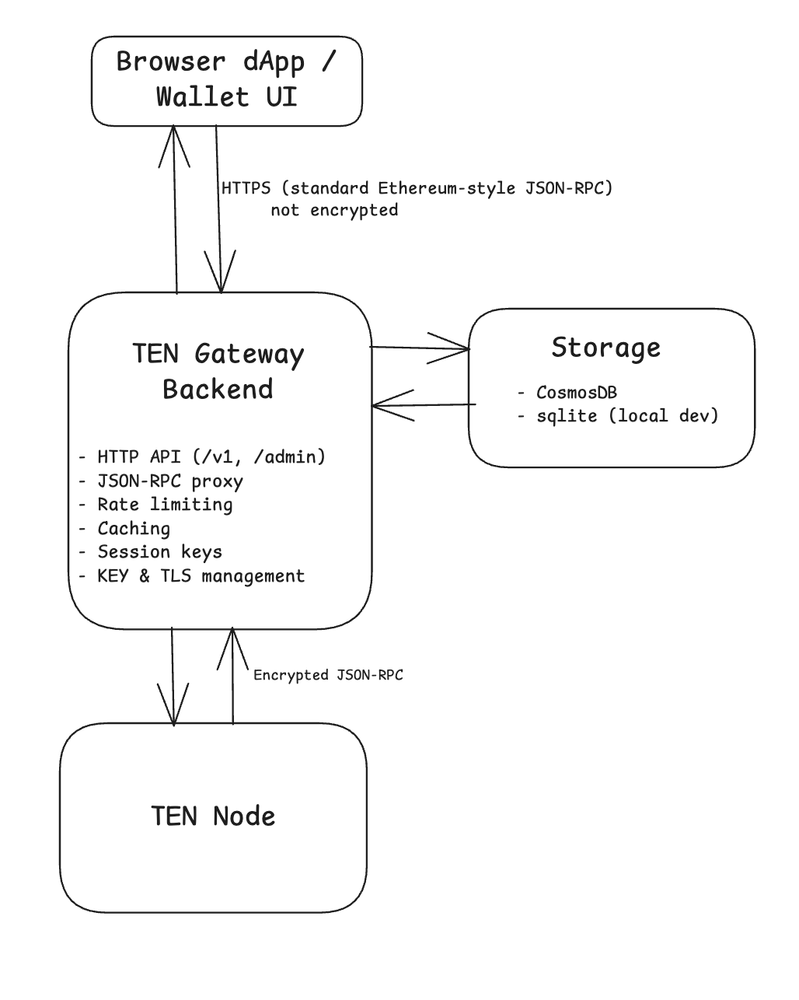

# TEN Gateway Documentation

This document focuses on the **TEN Gateway** in this repository.

## High‑level architecture

At a high level, the gateway sits between browser‑based dApps/wallets and the
TEN node. The **frontend talks to the gateway backend using standard,
Ethereum‑style JSON‑RPC / REST (payloads are not encrypted at the application
level), while the gateway backend talks to the TEN node over an **encrypted\*\*
JSON‑RPC channel inside the confidential compute environment.




## How authentication & viewing keys work

At a high level, users authenticate with the gateway using an **encryption token**
and a **viewing key** that is cryptographically tied to their wallet accounts. In
the code this token is often called `userID`, but in this document we always refer
to it as **`encryptionToken`**. The gateway uses the viewing key to open an
**encrypted, authenticated channel** to the TEN node on behalf of the user.

- **1. Create a user & token (`/v1/join`)**
  - Gateway generates a fresh viewing key pair and derives an `encryptionToken`
    from the viewing key public key.
  - It stores a `GWUser` (encryptionToken, viewing key, empty account list) in the DB.
  - It returns the `encryptionToken` as the **gateway token** (hex). This token
    identifies the user in both HTTP and JSON‑RPC flows.

- **2. Bind wallet accounts to the user (`/v1/getmessage` + `/v1/authenticate`)**
  - The dApp calls `/v1/getmessage` with the `encryptionToken` to get a canonical
    message to sign (EIP‑712 or personal sign), parameterised by the
    `encryptionToken` and TEN chain ID.
  - The user signs this message with their wallet (e.g. Metamask) and sends the
    signature and address to `/v1/authenticate?token=<encryptionToken>`.
  - The gateway verifies the signature and stores a `GWAccount` that proves the
    wallet account is bound to the viewing key (and thus to that `encryptionToken`).

- **3. JSON‑RPC calls carry the token**
  - For HTTP/WS JSON‑RPC, a small middleware inspects requests for a hex token
    and attaches it to the context as the **gateway token**.
  - The wallet extension RPC layer reads this token, validates it, converts it
    back to `encryptionToken` bytes and loads the corresponding `GWUser` from storage.

- **4. Encrypted RPC from gateway to node**
  - For authenticated methods, the gateway selects one or more accounts from
    `GWUser.AllAccounts()` and builds a `viewingkey.ViewingKey` object that
    includes:
    - the account address,
    - the viewing key (private & public),
    - the wallet’s binding signature.
  - It then creates an encrypted RPC client and calls the TEN node over an
    encrypted channel using this viewing key.
  - The node verifies the viewing key + signature and uses it to encrypt/decrypt
    user‑specific state and to decide whether the call is authorised.

- **5. Running actions on behalf of users**
  - **Reads** (balances, transactions, logs, custom queries) use the encrypted
    viewing‑key channel, so the node only returns data for accounts bound to that
    user.
  - **Writes** (transactions) can be sent via user‑owned session keys: the
    gateway signs with a session key that is linked to the user’s viewing key and
    submits it through the encrypted channel.
  - Background services (e.g. session‑key expiration and fund recovery) also use
    these viewing keys and session keys, allowing the gateway to safely perform
    automated operations on behalf of users while the node can still verify and
    enforce authorisation.

## Running the Gateway Locally

### Backend

To run the backend locally, it is recommended to use **port 1443** to avoid conflicts
with the frontend service, which typically runs on port 3000.

1. Build the backend using `go build`. From `tools/walletextension/main`:

   ```bash
   # macOS AMD64
   env GOOS=darwin GOARCH=amd64 go build -o ../bin/wallet_extension_macos_amd64 .

   # macOS ARM64
   env GOOS=darwin GOARCH=arm64 go build -o ../bin/wallet_extension_macos_arm64 .

   # Windows AMD64
   env GOOS=windows GOARCH=amd64 go build -o ../bin/wallet_extension_win_amd64.exe .

   # Linux AMD64
   env GOOS=linux GOARCH=amd64 go build -o ../bin/wallet_extension_linux_amd64 .
   ```

2. Run the compiled binary and specify the desired port and configuration flags, for example:

   ```bash
   ./wallet_extension_macos_arm64 \
     --port 1443 \
     --nodeHost erpc.sepolia-testnet.ten.xyz \
     --tenChainID 443
   ```

The binaries will be available in the `tools/walletextension/bin` directory.

### Additional Backend Configuration Options

All configuration is provided via CLI flags. Below is a summary of the most relevant options,
grouped by concern.

#### General & networking

- **`--host`**  
  Host where the gateway listens. Default: `127.0.0.1`.

- **`--port`**  
  HTTP port for the gateway. Default: `3000`.

- **`--portWS`**  
  WebSocket JSON‑RPC port. Default: `3001`.

- **`--tenChainID`**  
  Chain ID of the TEN network the gateway talks to. Default: `443`.

- **`--insideEnclave`**  
  Whether the process runs inside an enclave. Default: `false`.

#### Node connectivity

- **`--nodeHost`**  
  Host of the Obscuro/TEN node. Default: `erpc.sepolia-testnet.ten.xyz`.

- **`--nodePortHTTP`**  
  Node RPC port for HTTP. Default: `80`.

- **`--nodePortWS`**  
  Node RPC port for WebSockets. Default: `81`.

#### Logging & storage

- **`--logPath`**  
  Path for gateway log output. Default: `sys_out`.

- **`--logLevel`**  
  Log level (`critical`, `error`, `warn`, `info`, `debug`, `trace`). Default: `info`.

- **`--databasePath`**  
  Path for the gateway database file. Default: `.obscuro/gateway_database.db`.

- **`--storeIncomingTxs`**  
  Store incoming transactions in the DB for debugging. Default: `true`.

#### Database backend

- **`--dbType`**  
  Database type (`sqlite` or `cosmosDB`). Default: `sqlite`.

- **`--dbConnectionURL`**  
  Required when `--dbType=cosmosDB`; pass the Cosmos DB connection string / endpoint.

#### Encryption, TLS & key management

- **`--encryptionKeySource`**  
  Source of the encryption key for the gateway database.  
  Can be:
  - empty: read from a previously sealed key inside the enclave (default),
  - `new`: generate a new random key (only if no sealed key exists),
  - `hex:<32-byte-hex>`: import the key directly from a hex value (disaster‑recovery only; key is not derived or sealed elsewhere),
  - URL of another gateway to perform remote key exchange (this node becomes a key requester and calls `POST <url>/admin/key-exchange/`).

- **`--enableTLS`**  
  Enable TLS/HTTPS on the HTTP port. Default: `false`.

- **`--tlsDomain`**  
  TLS certificate domain name. Also used to derive the cookie name for the
  gateway token (`gateway_<domain>`).

- **`--encryptingCertificateEnabled`**  
  Enable encrypting‑certificate functionality. Default: `false`.

- **`--backupEncryptionKey`**  
  Hex‑encoded compressed ECDSA public key used by the
  `/admin/backup-encryption-key` endpoint to export an encrypted backup
  of the gateway encryption key. Default: empty (endpoint disabled).

#### HTTP CORS & frontend integration

- **`--frontendURL`**  
  Frontend origin allowed to call _restrictive_ CORS endpoints (e.g. `/v1/get-token/`, `/v1/set-token/`).  
  Default: `https://uat-gw-testnet.ten.xyz`.

#### Caching

- **`--disableCaching`**  
  Disable response caching for gateway RPC/HTTP calls (e.g. health and network
  config). Default: `false` (caching enabled).

#### Compute‑based rate limiting (per user)

- **`--rateLimitUserComputeTime`**  
  Maximum compute time a user may consume within `--rateLimitWindow`.  
  Set to `0` to disable this rate limiter. Default: `10s`.

- **`--rateLimitWindow`**  
  Sliding time window within which `--rateLimitUserComputeTime` is enforced.  
  Default: `1m`.

- **`--maxConcurrentRequestsPerUser`**  
  Maximum number of concurrent requests per user. Default: `3`.

#### HTTP endpoint rate limiting

- **`--httpRateLimitGlobalRate`**  
  Global HTTP rate limit (requests/second) for endpoints such as `/v1/join/`.  
  `0` disables the global limit. Default: `0` (disabled).

- **`--httpRateLimitPerIPRate`**  
  Per‑IP HTTP rate limit (requests/second) for endpoints such as `/v1/join/`.  
  `0` disables the per‑IP limit. Burst is automatically set to 1.5× the rate.  
  Default: `0` (disabled).

#### Session key expiration

- **`--sessionKeyExpirationThreshold`**  
  Inactivity threshold before a session key is considered expired.  
  If set to `0`, automatic session key expiration is disabled. Default: `24h`.

- **`--sessionKeyExpirationInterval`**  
  How often the background expiration service scans for expired session keys.  
  Default: `30m`.

### Frontend

The gateway UI is now maintained in a **separate repository**:

- `https://github.com/ten-protocol/gateway-ui`

## HTTP Endpoints

For a higher-level overview of these APIs and example usage, see the TEN docs on
[Programmable Access to Gateway](https://docs.ten.xyz/docs/write-ten-dapp/programmable-gateway-access).

The gateway exposes several HTTP endpoints for interaction. Paths are versioned
under `/v1` and some endpoints live under `/admin`.

### Public API (`/v1/...`)

- **`GET /v1/ready/`**  
  Lightweight readiness probe indicating the gateway process is up.

- **`POST /v1/join/`**  
  Creates a new user in the gateway, generates a fresh encryption token
  (user identifier), and returns it as a hex string.  
  The returned token must be supplied as the `token` query parameter to other
  endpoints and to the JSON‑RPC APIs.

- **`GET /v1/getmessage/`**  
  Request body:

  ```json
  {
    "encryptionToken": "<hex user token>",
    "formats": ["EIP712", "personal_sign"] // optional
  }
  ```

  Returns a message and type that the user should sign to authenticate
  themselves with the gateway. The gateway supports both personal‑sign and
  EIP‑712 based messages.

- **`POST /v1/authenticate/?token=<EncryptionToken>`**  
  Request body includes the signed message, signature and address:

  ```json
  {
    "address": "0x...",
    "signature": "0x...",
    "type": "EIP712" // optional, defaults to EIP712
  }
  ```

  Verifies the signature over the message returned by `/v1/getmessage/` and
  links the given account to the user identified by `token`. Multiple accounts
  can be associated with a single user (subject to internal limits).

- **`GET /v1/query/?token=<EncryptionToken>&a=<Address>`**  
  Returns whether the given address is already registered for the user:

  ```json
  {
    "status": true | false
  }
  ```

- **`POST /v1/revoke/?token=<EncryptionToken>`**  
  Deletes the user identified by `token` together with any associated viewing
  keys and session keys stored in the gateway database.

- **`GET /v1/health/`**  
  Basic health check of the gateway process. Uses a short‑living cache to avoid
  unnecessary load.

- **`GET /v1/network-health/`**  
  Returns the health status of the connected TEN node, wrapped in a JSON‑RPC‑like
  response. Results are cached briefly and periodically refreshed.

- **`GET /v1/network-config/`**  
  Returns static network configuration (contract addresses, registries, etc.)
  for the connected TEN network. The response is cached long‑term and refreshed
  on demand.

- **`GET /v1/version/`**  
  Returns the current gateway version as a plain string.

### Token cookie helpers

These endpoints are intended to work with a browser‑based frontend that uses a
cookie to store the gateway user token.

- **`GET /v1/get-token/`**  
  Reads the gateway token cookie (name derived from `--tlsDomain`, falling back
  to `gateway_token`) and:
  - validates that it is a proper hex token,
  - verifies the user exists in the database,
  - returns the token as a hex string in the response body.

- **`POST /v1/set-token/`**  
  Request body:
  ```json
  {
    "token": "<hex user token>"
  }
  ```
  Validates the token, verifies the corresponding user exists and sets a
  `HttpOnly`, `Secure`, `SameSite=None` cookie on the response.  
  The cookie:
  - is named based on `--tlsDomain` (e.g. `gateway_example_com`),
  - is scoped to domain `.ten.xyz` so it can be shared across subdomains,
  - has a very long lifetime (effectively permanent).

### Admin endpoints (`/admin/...`)

These are operational / enclave‑level endpoints and should be protected at
infrastructure level (e.g. only reachable from inside a trusted network).

- **`POST /admin/key-exchange/`**  
  Endpoint implemented by the **key‑provider** gateway (typically a primary,
  already‑provisioned enclave). It is called by another gateway that is
  bootstrapping its own encryption key using `--encryptionKeySource=<provider-url>`.

  Request body (`keymanager.KeyExchangeRequest`):

  ```json
  {
    "public_key": "<RSA public key bytes>",
    "attestation": "<attestation report bytes>"
  }
  ```

  High‑level flow:
  - The requesting gateway generates an ephemeral RSA key pair and an SGX
    attestation report over the hash of its public key.
  - It POSTs this data to `<provider-url>/admin/key-exchange/`.
  - The provider gateway:
    - verifies the attestation with `VerifyReport` to ensure the request
      comes from a valid enclave,
    - checks that the attested data matches the received public key,
    - encrypts its own database encryption key with the requester’s public key
      (RSA‑OAEP),
    - returns it as Base64 (`encrypted_key`) in `KeyExchangeResponse`.
  - The requesting gateway decrypts the key using its private key and then
    seals it locally (if running inside an enclave).

  This mechanism allows securely cloning the gateway encryption key between
  enclaves without ever exposing it in plaintext on the network.

- **`POST /admin/backup-encryption-key/`**  
  Uses the public key provided via `--backupEncryptionKey` to encrypt the
  internal encryption key and returns it as a hex string. This allows
  out‑of‑band backup of the gateway encryption key.

## Rate limiting

The gateway implements **two complementary layers** of rate limiting.

### 1. Per‑user compute‑time limiter (JSON‑RPC)

The `ratelimiter.RateLimiter` tracks how much _compute time_ (wall‑clock time
spent processing requests) each user consumes in a sliding window:

- **Compute budget**: `--rateLimitUserComputeTime`  
  Total allowed compute time per user within `--rateLimitWindow`.  
  If set to `0`, this limiter is disabled.

- **Window**: `--rateLimitWindow`  
  Time window over which compute is accumulated.

- **Concurrency cap**: `--maxConcurrentRequestsPerUser`  
  Upper bound on the number of concurrent requests per user.

When a new request arrives:

1. The gateway checks if the user already has too many open requests.
2. It sums the compute time of recent requests for that user.
3. If either limit is exceeded, the request is rejected and internal
   rate‑limited statistics are updated.

This limiter is applied at the **JSON‑RPC layer** and is keyed by a per‑user
identifier derived from the gateway’s notion of user (address / token).

### 2. HTTP rate limiter (global + per IP)

The `ratelimiter.HTTPRateLimiter` is applied at the HTTP level for selected
endpoints (currently `/v1/join/`, and it can be extended to others). It enforces:

- **Global rate** via `--httpRateLimitGlobalRate` (requests/second).  
  `0` disables the global limiter.

- **Per‑IP rate** via `--httpRateLimitPerIPRate` (requests/second).  
  `0` disables the per‑IP limiter. Burst is automatically set to 1.5× the rate.

Client IPs are determined using:

- `X-Forwarded-For` (first entry),
- `X-Real-IP`,
- or `RemoteAddr` as fallback.

If a request exceeds the configured limits, the gateway returns **HTTP 429**
with a `Retry-After` header and a JSON body of the form:

```json
{
  "error": "rate limit exceeded",
  "retry_after": <seconds>
}
```

## Caching

The gateway uses an in‑memory cache (Ristretto) to avoid redundant RPC calls and
to smooth load on the TEN node.

Key properties:

- **Backend**: `cache.RistrettoCache` (see `cache/RistrettoCache.go`).
- **Strategies** (via `cache.Cfg` / `cache.WithCache`):
  - `LongLiving` – used for data that changes rarely (e.g. network config).  
    Default TTL: **5 hours**.
  - `LatestBatch` – used for short‑lived data tied to the latest batch
    (e.g. health and network‑health).  
    Default TTL: **2 seconds**, with custom eviction logic when a new batch is
    processed.
  - `NoCache` – bypass the cache completely.

You can globally disable short‑living responses by setting `--disableCaching=true`,
which makes `LatestBatch` behave as “no cache” to avoid serving stale data.

Additionally, a **singleflight** group is used to ensure that concurrent requests
for the same key share a single upstream call and reuse the result.

## Session keys

For a dApp‑developer‑focused overview of native session keys and account abstraction on TEN, see
[Account Abstraction](https://docs.ten.xyz/docs/write-ten-dapp/session-keys).

Session keys are **ephemeral accounts managed by the gateway** on behalf of a
user. They are designed to support dApps and short‑lived sessions without
exposing long‑term keys.

### Session key model

- Each user can have **multiple session keys** (up to an 100 accounts).
- Each session key:
  - is a normal Ethereum account from the network’s point of view,
  - is linked to the user’s viewing key,
  - can be used to sign and submit transactions via the gateway.

The core implementation lives in `services/sk_manager.go`:

- `CreateSessionKey` generates a fresh keypair, signs over the user’s viewing
  key and persists the session key in storage.
- `SignTx` signs transactions using the session key’s private key.
- `DeleteSessionKey` can optionally sweep remaining funds back to the user’s
  primary account before deleting the key.

### Activity tracking and expiration

To avoid unbounded growth and stale keys, the gateway tracks activity and
optionally **expires** inactive session keys:

- `SessionKeyActivityTracker` (`services/session_key_activity.go`) keeps
  in‑memory records of:
  - last active time,
  - associated user identifier (the same `encryptionToken`).

- `SessionKeyExpirationService` (`services/session_key_expiration.go`) runs in
  the background and:
  - periodically scans for session keys older than
    `--sessionKeyExpirationThreshold`,
  - for each candidate:
    - reloads the owning user from storage,
    - attempts to move funds from the session key back to the user’s primary
      account using the gateway’s `TxSender`,
    - removes the key from the activity tracker and persists updated activity
      information.

The service is controlled by:

- **`--sessionKeyExpirationThreshold`** – how long a session key may stay idle
  before it is treated as expired (set to `0` to disable).
- **`--sessionKeyExpirationInterval`** – how often the expiration scan runs.

This mechanism lets you safely use many short‑lived session keys for dApps,
while automatically cleaning up inactive ones and protecting user funds.
